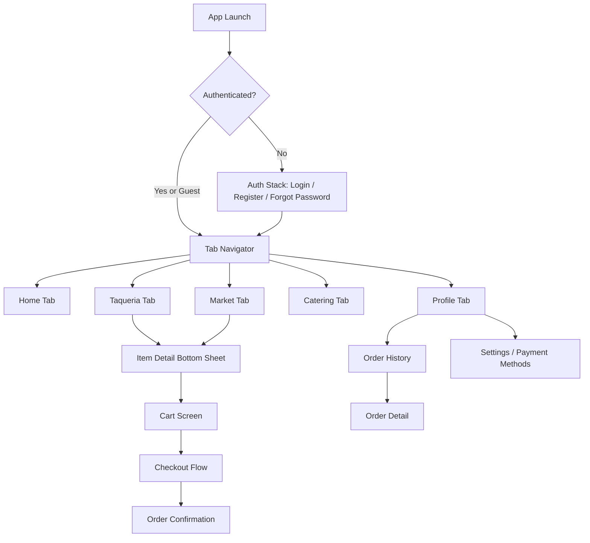

# Product Requirements Document
# Valencia's Carniceria & Taqueria — Mobile Ordering App

**Document Version:** 1.0
**Date:** April 13, 2026
**Author:** Product & Engineering Lead
**Status:** Draft — Pending Stakeholder Review

---

## 1. Executive Summary

Valencia's Carniceria & Taqueria is a family-owned Mexican restaurant and full-service grocery market in Citrus Heights, CA that has served its community since 2002. This PRD defines a fully native iOS and Android mobile application built with React Native 0.83 on Expo SDK 55 — leveraging the mandatory New Architecture (JSI/Fabric/TurboModules), React 19, and Hermes v1 — that consolidates the business's two ordering channels — the Taqueria and the Market — into a single branded app with modern authentication, an extensive menu browsing and customization experience, a unified cart, and multiple payment options including credit/debit card, Apple Pay, and PayPal.

The app replaces Valencia's current dependency on Snaptown, a third-party ordering platform with limited branding control and payment flexibility, and gives the business a direct-to-consumer mobile presence comparable in quality to DoorDash or Chipotle's native apps. For customers, it eliminates the friction of ordering through a generic third-party web interface and delivers a fast, intuitive, and visually polished ordering experience with expanded payment options.

Target platforms are iOS (App Store) and Android (Google Play), built from a single React Native codebase. The development timeline is 10 weeks across 5 phases, targeting an initial MVP launch followed by iterative enhancement.

---

## 2. Problem Statement & Opportunity

### The Business Problem

Valencia's currently relies on Snaptown for online ordering. This creates several constraints: the ordering experience carries Snaptown's branding rather than Valencia's, the restaurant has no native app presence in the App Store or Google Play, payment options are limited to credit/debit card only, and Valencia's has no direct ownership of customer data or relationship. Every order processed through Snaptown strengthens Snaptown's platform rather than Valencia's brand.

### The Customer Problem

Customers who want to order from Valencia's must navigate to a Snaptown web page that feels disconnected from the restaurant's identity. There is no dedicated app to install, no saved payment methods or order history, and no option to pay with Apple Pay, PayPal, or other modern payment methods. The experience is functional but generic — it does not reflect the warmth or authenticity of a business that has been a neighborhood institution for over two decades.

### The Opportunity

Single-location restaurants that invest in branded direct ordering apps see measurably higher repeat order rates, larger average order values, and lower customer acquisition costs compared to relying solely on third-party aggregators. Valencia's is uniquely positioned because it operates both a taqueria and a grocery market from the same location, which means a single app can serve two distinct shopping use cases (prepared food and raw ingredients/groceries) and drive cross-selling between them. The 10% first-order discount already in use through Snaptown can be carried forward as a native acquisition tool, and push notifications can drive re-engagement without ongoing advertising spend.

---

## 3. Goals & Success Metrics

### Product Goals

| Goal | KPI | 30-Day Target | 60-Day Target | 90-Day Target |
|------|-----|---------------|---------------|---------------|
| Drive app adoption | Total downloads (iOS + Android) | 500 | 1,500 | 3,000 |
| Shift orders to direct channel | % of total online orders via app | 20% | 40% | 60% |
| Increase average order value | AOV compared to Snaptown baseline | +5% | +10% | +12% |
| Build repeat usage | 30-day repeat order rate | 15% | 25% | 35% |
| Enable payment flexibility | % of orders using Apple Pay or PayPal | 10% | 20% | 25% |

MVP success is defined as the app reaching 500 downloads and processing 20% of total online order volume within 30 days of launch, with a crash-free rate above 99.5% and an average App Store rating of 4.0 or higher.

---

## 4. User Personas

### Persona 1: Maria — The Regular Taqueria Customer

Maria is a 35-year-old mother of two who lives in Citrus Heights. She orders from Valencia's Taqueria 2–3 times per month, usually picking up dinner for the family on weekday evenings. Her go-to order is a mix of tacos, a super burrito, and quesabirria tacos for the kids. She values speed — she wants to place her order in under 2 minutes, pay with Apple Pay, and pick it up on her way home from work. Her pain point with Snaptown is that it feels slow, she can't save her payment method, and she has to re-enter her selections every time.

**Key use cases:** Browse Taqueria menu → customize items (meat choice, tortilla choice) → add to cart → checkout with Apple Pay → pick up.

### Persona 2: Carlos — The Market Shopper

Carlos is a 50-year-old home cook who shops at Valencia's Market weekly for specialty meats, dried chiles, fresh produce, and Mexican brand groceries that he can't find at mainstream supermarkets. He orders delivery because he buys in bulk (arrachera by the pound, cases of Jarritos, pork for pozole). He wants to browse by category, see per-pound pricing clearly, and pay with his debit card. His pain point is that the current Snaptown market ordering experience doesn't feel like a proper grocery shopping app.

**Key use cases:** Browse Market by category (Beef, Pork, Produce, etc.) → add multiple items with specific quantities → choose delivery → pay with card → receive delivery.

### Persona 3: Elena — The Catering Event Planner

Elena is a 42-year-old office manager who organizes team lunches and family gatherings. She orders catering from Valencia's 3–4 times per year — usually tamales, street tacos, or taquito trays. She needs to specify event date, guest count, and special requests. She values being able to submit an inquiry quickly from her phone and get a confirmation. Her pain point is having to call the restaurant during business hours or fill out a web form on a small screen.

**Key use cases:** Open Catering tab → fill out inquiry form (date, guest count, preferences) → submit → receive confirmation.

---

## 5. Scope & Feature Requirements

### 5.1 Authentication & Onboarding (P0)

**Description:** Users can create an account, sign in, or continue as a guest. Authentication supports email/password, Google OAuth, and Apple Sign-In.

| User Story | Acceptance Criteria | Priority |
|------------|-------------------|----------|
| As a new user, I want to create an account with my email so I can track my orders. | Account creation with email verification. Password minimum 8 characters. Error states for duplicate email, weak password, and invalid format. | P0 |
| As a user, I want to sign in with Google so I can skip manual entry. | Google OAuth flow completes and creates/links account. Profile name and photo imported. | P0 |
| As an iOS user, I want to sign in with Apple so I can use Face ID. | Apple Sign-In flow completes per Apple HIG. Supports "Hide My Email." | P0 |
| As a first-time visitor, I want to browse and order as a guest so I don't have to create an account. | Guest can browse menus, add to cart, and complete checkout. Prompted (non-blocking) to create account at checkout. | P0 |
| As a returning user, I want to stay signed in across app restarts. | Auth state persisted via secure storage. Biometric unlock optional. | P0 |
| As a user, I want to reset my password if I forget it. | Forgot password sends reset email. Inline error if email not found. | P0 |
| As a user, I want to delete my account permanently. | Account deletion flow with confirmation. All user data purged within 30 days. Required by App Store. | P0 |

**Edge Cases:** Token expiration during checkout should not lose cart. Guest-to-authenticated conversion must merge any existing cart. Apple Sign-In "Hide My Email" relay addresses must be handled. Network failure during OAuth should show retry option, not crash.

### 5.2 Home Screen (P0)

**Description:** The landing screen after authentication, providing quick access to both ordering channels, store information, and promotions.

| User Story | Acceptance Criteria |
|------------|-------------------|
| As a user, I want to see whether the store is currently open so I know if I can order now. | Open/closed badge computes from device time against business hours (Mon–Thu 8AM–8PM, Fri–Sun 8AM–9PM). If closed, show "Pre-order for later" messaging. |
| As a user, I want to quickly choose between ordering from the Taqueria or the Market. | Two prominent CTA cards navigate to the respective menu tabs. |
| As a user, I want to call the restaurant or get directions from the home screen. | Tappable phone number opens dialer. Directions button opens Apple Maps / Google Maps with the store address pre-filled. |
| As a first-time user, I want to see the 10% off promotion so I'm incentivized to order. | Promo banner visible on home screen. Discount auto-applied at checkout for first-time orders. |

### 5.3 Taqueria Menu (P0)

**Description:** A natively rendered, category-organized menu for the Taqueria's 100+ items across 11 categories (Breakfast Plates, Breakfast Burritos, Burritos, Tacos, A La Carta & Sides, Antojitos, Seafood Plates, Quesadillas, Combo Plates, Beverages, Catering Menu).

| User Story | Acceptance Criteria |
|------------|-------------------|
| As a user, I want to browse the menu by category using sticky tabs. | Horizontal scrollable category tabs at the top. Tapping a tab scrolls to that section. Scrolling the list updates the active tab. |
| As a user, I want to see item name, description (truncated), price, and photo on each card. | Item cards render in a scrollable list. Description truncated to 2 lines with ellipsis. Price right-aligned. |
| As a user, I want to tap an item to see its full details and customization options. | Bottom sheet slides up with item image, full description, all option groups (as defined in Section 7 and Appendix A/B of this document), special instructions field, quantity selector, and "Add to Cart" button with dynamic total. |
| As a user, I want to select required options before adding to cart. | If a required option group (e.g., Tortilla Choice, Meat Choice) is not selected, the "Add to Cart" button is disabled with a visual indicator on the unselected group. |
| As a user, I want to search for a menu item by name. | Search bar at top of menu. Filters items across all categories in real time. Empty state if no results. |

**Item customization details** are fully documented in Section 7 (Option Group Templates) and Appendix A of this PRD. The data model for option groups must exactly match those templates — including upcharge amounts (e.g., Lengua +$1.99, Tripas +$1.99 on Burrito Meat Choice; Extra Burrito Meat +$2.59) and the specific items each template applies to.

**Edge cases:** Items with no image should render a branded placeholder. Category with zero available items (e.g., if a category is temporarily disabled in a future admin panel) should not display. Long item names must not overflow the card layout. Special Instructions field should have a 500-character limit.

### 5.4 Market Menu (P0)

**Description:** A natively rendered, category-organized menu for the Market's 200+ items across 13 categories (Beef, Pork, Seafood, Poultry, Cheese/Other, Produce, Tortillas/Tostadas, Canned Products, Grocery, Dry Beans/Rice/Pastas, Hot Sauces, Hot Food, Beverages, Beer).

| User Story | Acceptance Criteria |
|------------|-------------------|
| As a market shopper, I want to see per-unit pricing (per lb, per ea, per oz) clearly on each item. | Unit label displayed below item name on each card. Price formatted with unit context. |
| As a market shopper, I want to browse meat by cut type so I can find what I need for my recipe. | Beef category shows all 15 cuts. "10 POUND MAX" note displayed as category-level banner. |
| As a market shopper, I want to choose marinated or non-marinated for the Arrachera. | Beef Flap/Arrachara item detail shows Seasoning option group (Required): Non Marinated, Marinated. |
| As a user, I want to order beer for delivery or pickup. | Beer category displays all 24 products with size/format labels. Age verification gate required (see Section 11). |

**Edge cases:** Produce items priced per-each (e.g., Chile Jalapeno $0.15/ea) may have quantities of 10+. Quantity selector must support higher counts without becoming cumbersome. Beer items must trigger an age verification prompt before adding to cart.

### 5.5 Cart Management (P0)

**Description:** A unified cart that holds items from both Taqueria and Market, persists across sessions, and is accessible from a floating action button visible on menu screens.

| User Story | Acceptance Criteria |
|------------|-------------------|
| As a user, I want one cart that holds items from both the Taqueria and the Market. | Single cart instance. Items tagged with source (Taqueria/Market) for display grouping. |
| As a user, I want to see a floating cart button showing my item count and subtotal. | Cart FAB visible on menu screens. Shows badge with item count and formatted subtotal. Tapping opens cart screen. |
| As a user, I want to edit an item's customizations from the cart. | Tapping an item in cart re-opens its bottom sheet with current selections pre-filled. Saving updates the cart entry. |
| As a user, I want my cart to persist if I close the app. | Cart state persisted via MMKV. Restored on next app launch. Cart cleared after successful order. |

**Edge cases:** If menu prices change between adding to cart and checkout, the app should use the price at time of order submission (consider a staleness warning if cart is >24 hours old). Removing the last item should show an empty cart state with a CTA to browse menus. Maximum cart size should be capped at 50 items.

### 5.6 Checkout & Payments (P0)

**Description:** A multi-step checkout flow covering order type, delivery details, tip, payment, and confirmation.

| User Story | Acceptance Criteria |
|------------|-------------------|
| As a user, I want to choose between pickup and delivery. | Toggle at top of checkout. Selecting delivery reveals address input and delivery fee. |
| As a delivery user, I want to enter my address with autocomplete. | Google Places autocomplete. Address validated against delivery zones. Out-of-zone shows error with pickup suggestion. |
| As a delivery user, I want to see my delivery fee based on my zone. | Fee computed from address against 5 zones ($7.99–$12.99). Displayed in order summary before payment. |
| As a user, I want to schedule my order for a later time. | "Schedule for later" option with date/time picker. Constrained to business hours. Default is "ASAP." |
| As a user, I want to add a tip. | Tip selector with preset percentages (10%, 15%, 20%, 25%) and custom amount. Default 15%. Tip shown in order total. |
| As a user, I want to pay with my credit/debit card. | Stripe prebuilt payment UI. Supports saving card for future use. PCI-compliant — no raw card data handled by the app. |
| As an iOS user, I want to pay with Apple Pay. | Apple Pay button prominent on iOS. Integrated via Stripe Apple Pay. Single biometric confirmation. |
| As a user, I want to pay with PayPal. | PayPal SDK integration. Opens PayPal flow in-app (not external Safari). Returns to app on completion. |
| As a first-time user, I want my 10% discount applied automatically. | First-order promo detected from user account (or device fingerprint for guests). Discount line item shown in summary. |
| As a user, I want a confirmation screen with my order number after checkout. | Order confirmation screen with order number, estimated time, order summary, and a "Track Order" or "Done" CTA. |

**Edge cases:** Payment failure should not clear the cart — show retry with error message. Network timeout during payment submission should show "Checking order status" with a spinner rather than allowing double-submission. If the store closes while a user is in checkout, show a warning that their order will be scheduled. Tip should be editable after initial selection. Zero-dollar orders (100% discount) should skip payment method selection.

### 5.7 Catering Inquiry (P0)

**Description:** A native form for submitting catering requests, separate from the ordering flow.

| User Story | Acceptance Criteria |
|------------|-------------------|
| As an event planner, I want to submit a catering inquiry from my phone. | Form with 6 fields: Name, Email, Phone, Event Date, Number of Guests, Additional Info. All required except Additional Info. |
| As an authenticated user, I want my contact info pre-filled. | Name, email, phone auto-populated from user profile. Editable. |
| As a user, I want confirmation that my inquiry was sent. | Success screen after submission. "We'll get back to you within 24 hours" messaging. |

**Edge cases:** Date picker should not allow past dates. Guest count should be positive integer. Phone field should accept US formats. Backend should send email to restaurant and confirmation email to user. Rate limit to prevent spam (max 3 submissions per hour per user/device).

### 5.8 Profile & Account Management (P0)

**Description:** Account settings, order history, saved payment methods, and app preferences.

| User Story | Acceptance Criteria |
|------------|-------------------|
| As a user, I want to view my past orders and reorder from them. | Order history list sorted by date (newest first). Each entry shows order number, date, total, and item count. Tapping opens detail view. |
| As a user, I want to manage my saved payment methods. | List of saved cards with last-4 digits and brand icon. Add/remove cards. Default payment selection. |
| As a user, I want to toggle dark mode. | Dark mode toggle in settings. Respects system preference by default. Manual override persisted. |
| As a guest user, I want a clear path to create an account. | Guest profile screen shows "Create Account" CTA prominently. |

### 5.9 Push Notifications (P1)

**Description:** Order status updates and optional promotional notifications.

| Notification Type | Trigger | Priority |
|-------------------|---------|----------|
| Order Confirmed | Order successfully submitted | P0 |
| Order Being Prepared | Restaurant acknowledges order | P1 |
| Order Ready for Pickup | Kitchen marks order ready | P1 |
| Order Out for Delivery | Driver assigned | P1 |
| Promotional | Admin-triggered (new items, specials) | P2 |

Users must be able to opt in/out of promotional notifications independently from order notifications. Notification permission prompt should be deferred until after first successful order, not on first launch.

---

## 6. Information Architecture & Navigation

The app uses a bottom tab navigator with 5 tabs as the primary navigation structure. Stack navigators are nested within each tab for drill-down flows. Modal presentations are used for item detail bottom sheets, and a full-screen stack is used for the checkout flow.



**Deep linking:** The app should support deep links to specific menu categories and the catering form (e.g., `valencias://taqueria/burritos`, `valencias://catering`) for use in marketing materials and push notifications.

---

## 7. Data Model & Menu Schema

### TypeScript Interfaces

The menu data is defined by three core TypeScript interfaces:

```typescript
interface MenuItem {
  id: string;
  name: string;
  description: string;
  price: number;
  category: string;
  subcategory?: string;
  image?: string; // URL or local asset
  unit?: string; // "Per lb.", "ea", "10oz", etc.
  maxQuantityNote?: string; // e.g., "10 POUND MAX"
  options: ItemOptionGroup[];
}

interface ItemOptionGroup {
  id: string;
  name: string; // e.g., "Tortilla Choice", "Burrito Meat Choice"
  required: boolean;
  type: 'single_select' | 'optional_toggle';
  choices: ItemChoice[];
}

interface ItemChoice {
  id: string;
  name: string;
  priceModifier: number; // 0 for no extra charge, positive for upcharge
}
```

### Reusable Option Group Templates

The following 15 option group templates are shared across menu items. When building the data layer, define these once and reference them by ID on each item.

**1. Tortilla Choice** (Required, Single Select)
- Corn Tortillas
- Flour Tortillas
- *Used by:* All Breakfast Plates, Chilaquiles, Combo Plates (1–5, 7–13, 17), Enchiladas, Enchiladas Verdes, Flautas, Tostada de Ceviche, Combo Tacos #18, Combo Tacos Dorados #19

**2. Burrito Meat Choice** (Required, Single Select)
- Asada/Steak
- Pollo/Chicken
- Barbacoa/Shredded Beef
- Carnitas/Shredded Fried Pork
- Alpastor/Marinated Pork
- Chorizo/Mexican Sausage
- Lengua (+$1.99)
- Tripas (+$1.99)
- *Used by:* Regular Burrito, Super Burrito, Chimichanga, Quesadilla (with meat), Quesadilla Combo (with meat)

**3. Taco Meat Choice** (Required, Single Select)
- Asada/Steak
- Pollo/Chicken
- Barbacoa/Shredded Beef
- Carnitas/Shredded Fried Pork
- Alpastor/Marinated Pork
- Chorizo/Mexican Sausage
- *Used by:* Super Taco, Torta, Taco Salad, Tostada, Sope, Combo #18 Tacos, Combo #19 Tacos Dorados

**4. Nacho Meat** (Required, Single Select)
- Asada/Steak
- Pollo/Chicken
- Barbacoa/Shredded Beef
- Carnitas/Shredded Fried Pork
- Alpastor/Marinated Pork
- Chorizo/Mexican Sausage
- Lengua (+$0.99)
- Tripas (+$0.99)
- *Used by:* Nachos (With meat)

**5. Enchilada/Flauta Size** (Required, Single Select)
- Beef
- Chicken
- Pork
- Cheese
- *Used by:* Enchiladas, Flautas

**6. Fajita Size** (Required, Single Select)
- Chicken
- Steak
- *Used by:* Fajitas (#6)

**7. Chili Sauce** (Required, Single Select)
- Green
- Red
- *Used by:* Chilaquiles Rojos/Verde

**8. Extra Burrito Meat** (Optional Toggle)
- Yes (+$2.59)
- No
- *Used by:* Regular Burrito, Super Burrito, Chimichanga

**9. Extra Meat** (Optional Toggle)
- Yes (+$2.59 for Nachos, +$1.99 for Quesadilla)
- *Used by:* Nachos (With meat), Quesadilla (with meat)

**10. Soda Choice** (Required, Single Select)
- Watermelon, Strawberry, Mandarin, Mango, Guava, Fanta Orange, Miner Agua Sparkling Water, Coca-Cola Bottle, Squirt
- *Used by:* Sodas

**11. Breakfast Meat Choice** (Required, Single Select)
- Bacon
- Ham
- Chorizo
- *Used by:* #34 Burrito Combinado

**12. Tamale Size** (Required, Single Select)
- Chicken
- Pork
- Cheese
- Uchepos (corn)
- *Used by:* Tamales (Catering)

**13. Tamale Ingredients** (Optional Toggle)
- Add Ingredients (+$12.00)
- *Used by:* Tamales (Catering)

**14. Seasoning** (Required, Single Select)
- Non Marinated
- Marinated
- *Used by:* Beef Flap/Arrachara (Market)

**15. Special Instructions** (Optional, Free Text)
- Placeholder: "Example: No pepper / sugar / salt please."
- *Used by:* ALL items

### File Structure (Expo Router v5)

```
app/
├── _layout.tsx                # Root layout — auth state check, Stack.Protected for auth guard
├── (auth)/
│   ├── _layout.tsx            # Auth stack layout
│   ├── login.tsx
│   ├── register.tsx
│   └── forgot-password.tsx
├── (tabs)/
│   ├── _layout.tsx            # Tab bar configuration (Home, Taqueria, Market, Catering, Profile)
│   ├── index.tsx              # Home screen
│   ├── taqueria.tsx           # Taqueria menu (FlashList + sticky category tabs)
│   ├── market.tsx             # Market menu (FlashList + sticky category tabs)
│   ├── catering.tsx           # Catering inquiry form (React Hook Form)
│   └── profile.tsx            # User profile & settings
├── cart.tsx                   # Cart screen (full-screen stack)
├── checkout.tsx               # Checkout flow (full-screen stack)
├── order-confirmation.tsx     # Order success
├── order-history.tsx
├── order-detail/[id].tsx      # Dynamic route — typed via Expo Router
└── +not-found.tsx
```

**Expo Router v5 specifics:**
- Use `Stack.Protected` in root layout for automatic client-side auth redirects (replaces conditional navigator rendering)
- Use typed routes (`href={{ pathname: '/order-detail/[id]', params: { id } }}`) for compile-time navigation safety
- Use `useLocalSearchParams` (not `useSearchParams`) for screen-level params to avoid unnecessary re-renders
- Item detail bottom sheet is presented as a modal overlay via `@gorhom/bottom-sheet`, not a routed screen — this avoids navigation stack complexity and enables swipe-to-dismiss
- Async route splitting enabled by default — order history and profile settings lazy-load, reducing initial bundle size

### Menu Data Storage Strategy

For MVP, all menu data is hardcoded as TypeScript constants in the codebase, organized by channel (Taqueria, Market) and category. This eliminates backend dependency for menu rendering and ensures offline browsing capability. Post-MVP, the data layer migrates to Supabase Postgres tables with a restaurant admin panel for dynamic menu management, and the app fetches menu data via API with local caching.

---

## 8. Technical Architecture

### Tech Stack

| Layer | Technology | Rationale |
|-------|------------|-----------|
| Framework | React Native 0.83 / Expo SDK 55 | Latest stable SDK (Feb 2026). New Architecture mandatory — no legacy bridge. Hermes v1 engine available for opt-in performance gains. |
| Language | TypeScript (strict mode) | Type safety across data model, state, navigation, and UI. Non-negotiable in 2026 React Native. |
| Navigation | Expo Router v5 | File-based routing with typed routes (compile-time navigation safety), `Stack.Protected` for auth guards, automatic deep linking, async route splitting for faster dev builds. |
| Client State | Zustand 5.x + MMKV | Minimal API, excellent TypeScript support. MMKV for persistent cart and preferences. React 19 compatible. |
| Server State | TanStack Query 5.x | Caching, background refetching, optimistic updates for order history and future dynamic menu fetching. Same API as web — zero learning curve. |
| UI Styling | NativeWind v4 (Tailwind CSS for RN) | Utility-first styling. Consistent spacing/color design tokens. Dark mode support via `dark:` variants. |
| Native UI Primitives | `@expo/ui` (SwiftUI + Jetpack Compose) | For platform-specific components where native feel matters: date pickers, toggles, confirmation dialogs. Expo UI exposes real SwiftUI/Compose components — not JavaScript reimplementations. Use selectively alongside NativeWind for cross-platform views. |
| Animations | React Native Reanimated v3 | 60fps gesture-driven animations running on the UI thread via JSI. Required for bottom sheet gestures, shared element transitions, and haptic-coupled animations. |
| Lists | FlashList (`@shopify/flash-list`) | Replaces FlatList for menu rendering. Significantly better scroll performance on large lists (200+ market items). Recycler-based architecture. |
| Bottom Sheets | `@gorhom/bottom-sheet` v5 | Production-grade bottom sheet with gesture handling, snap points, keyboard avoidance. New Architecture compatible. |
| Auth | Supabase Auth | Email/password, Google OAuth, Apple Sign-In providers. Row Level Security for user data. Edge Functions for server-side logic. |
| Payments | `@stripe/stripe-react-native` + PayPal SDK | PCI-compliant card handling via prebuilt UI, Apple Pay via Stripe, PayPal in-app checkout. |
| Notifications | `expo-notifications` + FCM/APNs | Push notification delivery. Note: push notifications require development builds in SDK 55 (removed from Expo Go on Android). |
| Images | `expo-image` | Fast cached image loading with blurhash placeholders, AVIF/WebP support, memory-efficient. |
| Maps | `expo-maps` | New Expo-native maps package built on SwiftUI (iOS 18+) and Jetpack Compose. Falls back to `react-native-maps` for older OS versions. |
| Blur Effects | `expo-blur` | Now stable on Android in SDK 55 using RenderNode API. Low-cost background blurs for modals and overlays. |
| Edge-to-Edge | `react-native-edge-to-edge` | Full-screen immersive layouts on Android (mandatory in Android 16 / API 36). Enabled by default in SDK 55. |
| Forms | React Hook Form | Lightweight, performant form management. Same API as web React. Used for catering form and checkout fields. |
| Build & Deploy | EAS Build + EAS Submit + EAS Update | Cloud builds with build caching (up to 30% faster rebuilds), OTA updates with Hermes bytecode diffing (smaller update bundles), frozen lockfiles for reproducible installs. |
| Backend | Supabase (Postgres + Edge Functions + Realtime) | Order persistence, catering form, user profiles, future real-time order tracking via Supabase Realtime subscriptions. |

### New Architecture (Mandatory)

As of Expo SDK 55 / React Native 0.83, the Legacy Architecture (JSON bridge) has been permanently removed. All apps run on the New Architecture by default:

- **JSI (JavaScript Interface):** JavaScript holds direct references to C++ native objects. No more JSON serialization between JS and native threads. This is why animations and gestures feel native.
- **Fabric:** The new UI renderer with concurrent React 19 support. Enables `useTransition`, `Suspense`, and streaming server components.
- **TurboModules:** Native modules load lazily (only when called), reducing cold start time and memory usage.

All third-party dependencies must be New Architecture compatible. Run `npx expo-doctor` to validate library compatibility before adding any dependency. ~85% of popular React Native packages are compatible as of April 2026.

### React Compiler Integration

Expo SDK 55 supports the **React Compiler**, which automatically memoizes components and eliminates unnecessary re-renders. This is particularly impactful for menu screens with 100+ item cards and the checkout flow with multiple dynamic fields. Enable via `npx expo lint` to prepare the codebase, then opt in via the Expo config. Screen transitions become noticeably smoother with automatic memoization.

### Architecture Overview

```
┌─────────────────────────────────────────────────────────┐
│                    Mobile Client                         │
│  ┌────────────┐ ┌────────────┐ ┌──────────────────────┐ │
│  │ Expo       │ │ Zustand 5  │ │ NativeWind v4 +      │ │
│  │ Router v5  │ │ + MMKV     │ │ Reanimated v3 +      │ │
│  │ (typed     │ │ + TanStack │ │ @expo/ui (SwiftUI /   │ │
│  │  routes)   │ │   Query 5  │ │ Jetpack Compose)     │ │
│  └────────────┘ └────────────┘ └──────────────────────┘ │
│  ┌──────────────────────────────────────────────────────┐│
│  │    New Architecture (JSI / Fabric / TurboModules)     ││
│  ├──────────────────────────────────────────────────────┤│
│  │              API / Service Layer                      ││
│  │  Auth · Orders · Payments · Notifications · Realtime ││
│  └──────────────────────────────────────────────────────┘│
└──────────┬────────────┬────────────┬────────────────────┘
           │            │            │
   ┌───────▼──┐  ┌──────▼─────┐  ┌──▼──────────┐
   │ Supabase │  │  Stripe    │  │ FCM / APNs  │
   │ Backend  │  │ + PayPal   │  │ (via expo-  │
   │ + Edge   │  │            │  │ notifications│
   │ Functions│  │            │  │  + dev build)│
   └──────────┘  └────────────┘  └─────────────┘
```

### Performance Targets

| Metric | Target | How Achieved |
|--------|--------|-------------|
| Cold start to home screen | < 1.5 seconds | Hermes v1 engine, TurboModules lazy loading, async route splitting |
| Menu scroll FPS (200+ items) | 60fps consistently | FlashList recycler architecture, React Compiler auto-memoization |
| Item detail bottom sheet open | < 200ms | Reanimated v3 worklet animations on UI thread via JSI |
| Add to cart response | < 50ms (local state) | Zustand direct state mutation, no bridge overhead |
| Checkout submission to confirmation | < 4 seconds | Supabase Edge Functions (low latency), Stripe server-side PaymentIntent |
| Crash-free rate | > 99.5% | Sentry error monitoring, Hermes stable engine, expo-doctor CI checks |
| OTA update download | < 500KB typical | Hermes bytecode diffing (only changed bytes shipped) |

### Offline Behavior

Menu data is bundled in the app (hardcoded constants), so browsing and adding to cart work fully offline. Cart state is persisted to MMKV. Checkout requires network connectivity — if offline, show a clear "No connection" message with retry. Order history is cached locally via TanStack Query's persistence layer and synced on next launch.

---

## 9. UI/UX Requirements

### Design System

The visual identity marries Valencia's warm, family-owned heritage with the crisp, modern utility of apps like DoorDash. The color palette centers on a rich red primary (`#C41E24`) for calls-to-action, a forest green secondary (`#1B5E20`) for success states and the open/closed indicator, and warm neutrals for backgrounds and text. An accent gold (`#D4A844`) highlights featured items and promotions.

Typography uses a bold sans-serif (Inter, SF Pro Display, or Poppins) for headings and a regular weight for body text. All interactive elements meet the 44×44pt minimum touch target. The spacing scale follows 4px increments: 4, 8, 12, 16, 20, 24, 32, 40, 48px.

### Modern UI Patterns (2026 Standards)

**Edge-to-Edge Layouts (Android):** The app uses `react-native-edge-to-edge` for full-screen immersive content on Android. Content renders behind the system status bar and navigation bar with proper safe area insets. This is mandatory for Android 16 (API 36) and enabled by default in Expo SDK 55. All screens must account for safe areas using `useSafeAreaInsets()` from `react-native-safe-area-context`.

**FlashList for Menu Rendering:** All menu lists (109 Taqueria items, 200+ Market items) use `@shopify/flash-list` instead of FlatList. FlashList's recycler-based architecture delivers consistent 60fps scroll performance even on budget Android devices. Configure with `estimatedItemSize` for optimal recycling.

**`@expo/ui` for Platform-Native Components:** Where native platform feel matters, use Expo UI primitives instead of JavaScript reimplementations:
- **DatePicker** (from `@expo/ui/swift-ui` / `@expo/ui/jetpack-compose`): Native date picker for order scheduling and catering event date. Renders real SwiftUI DatePicker on iOS and Material3 DatePicker on Android.
- **Toggle** (Expo UI): Native toggle for settings (dark mode, notification preferences). Renders SwiftUI Toggle on iOS and Material3 Switch on Android.
- **ConfirmationDialog** (Expo UI): Native confirmation for destructive actions (delete account, clear cart). Platform-appropriate alert styling.
- **ProgressView** (Expo UI): Native progress indicators for checkout submission loading state.

For cross-platform consistency in the core ordering flow (menu cards, cart, checkout summary), continue using NativeWind-styled React Native `View`/`Text` components. The strategy is: **Expo UI for chrome and controls, NativeWind for content and layout.**

**Background Blur Effects:** Use `expo-blur` (now stable on Android in SDK 55 via RenderNode API) for:
- Bottom sheet backdrop blur when item detail is open
- Modal overlays during checkout confirmation
- Promo banner overlay on hero image

**Shared Element Transitions:** Use Expo Router's native **Apple Zoom transition** (SDK 55) for item card → item detail transitions on iOS. When a user taps a menu item card, the card image smoothly transitions into the bottom sheet hero image using iOS's native interactive zoom transition. On Android, use a standard slide-up animation via Reanimated.

### Key Interaction Patterns

The menu screen uses **sticky horizontal category tabs** that synchronize bidirectionally with scroll position — tapping a tab scrolls to that section, and scrolling the content updates the active tab. Item detail is presented as a **bottom sheet** that slides up from the bottom edge, is dismissible by swiping down, and contains the item image, description, all option groups, special instructions, quantity selector, and an "Add to Cart" button with a dynamically computed total. A **cart FAB** (floating action button) is anchored to the bottom-right of menu screens, showing the current item count as a badge and the subtotal.

**Skeleton loading** states are used for all async content (use `react-native-skeleton-placeholder` or build with Reanimated shimmer). **Haptic feedback** fires on add-to-cart, checkout confirmation, and error states using `expo-haptics`. **Toast notifications** provide non-blocking feedback ("Added to cart", "Item removed") using `react-native-toast-message` or a custom Reanimated-driven toast. **Pull-to-refresh** uses `PullToRefreshBox` from Expo UI (Jetpack Compose) on Android and native `RefreshControl` on iOS for future dynamic menu fetching.

**React 19 Concurrent Features:** Leverage React 19's `useTransition` for non-blocking UI updates during heavy operations like menu category switching (prevent jank when scrolling to a distant category) and `Suspense` boundaries for lazy-loaded screens (order history, profile settings).

### Dark Mode

Dark mode is supported from launch, following the system preference by default with a manual override in settings. Use `Host.colorScheme` (Expo UI) for dynamic theming of native components. All NativeWind-styled components use `dark:` variant classes. Bottom sheets and modals use dark surface colors. Item images are not affected by dark mode. The `DayNight` theme is the default in SDK 55 Android projects.

### Accessibility

All interactive elements have accessible labels. Screen reader navigation follows logical reading order. Color is never the sole indicator of state (always paired with text or icon). Contrast ratios meet WCAG AA (4.5:1 body text, 3:1 large text). Font scaling up to 200% must not break layout. Use `monospacedDigit` modifier (Expo UI) for stable number layouts in price displays — prevents layout shifting when prices change dynamically in the cart.

---

## 10. API & Integration Requirements

### Payment Integrations

**Stripe** serves as the primary payment processor, handling credit/debit card collection via its prebuilt UI components and Apple Pay via Stripe's Apple Pay integration. The app never touches raw card data — all PCI scope is delegated to Stripe's SDK. A Supabase Edge Function creates Stripe PaymentIntents on the server side.

**PayPal** is integrated via the PayPal React Native SDK. The PayPal flow opens within the app (not external Safari) and returns control to the app on completion. Server-side order capture is handled via Supabase Edge Function calling the PayPal Orders API.

### Backend Endpoints

| Endpoint | Method | Purpose |
|----------|--------|---------|
| `/orders` | POST | Submit order (items, customizations, payment token, order type, address) |
| `/orders/:id` | GET | Retrieve order status and details |
| `/orders/history` | GET | List user's past orders |
| `/catering` | POST | Submit catering inquiry (sends email to restaurant) |
| `/users/profile` | GET/PUT | Retrieve or update user profile |
| `/payments/intent` | POST | Create Stripe PaymentIntent |
| `/payments/methods` | GET/DELETE | List or remove saved payment methods |

### Third-Party Dependencies

| Service | Purpose | Fallback |
|---------|---------|----------|
| Stripe | Payments | PayPal as alternate |
| PayPal | Alternate payment | Stripe-only checkout |
| Google Places | Address autocomplete | Manual address entry |
| Supabase Auth | Authentication | N/A (critical path) |
| FCM / APNs | Push notifications | In-app order status polling |
| Google Maps | Static map on home screen | Address text display only |

---

## 11. Security & Compliance

**PCI Compliance:** The app achieves PCI compliance by delegating all card data handling to Stripe's prebuilt UI. No raw card numbers, CVVs, or expiration dates are stored, transmitted, or processed by the app or backend.

**Apple App Store:** Apple Sign-In is implemented (required because Google Sign-In is offered). Account deletion is implemented per Apple's guidelines. App Tracking Transparency (ATT) prompt is presented if any analytics or advertising SDKs are integrated. Privacy Nutrition Labels are completed accurately during submission.

**Google Play:** Data Safety section is completed. Target SDK meets current Play Store requirements. Data handling disclosures are accurate.

**CCPA:** As a California-based business serving California customers, the app's privacy policy must disclose data collection and provide a mechanism for data deletion requests. The Delete Account feature satisfies the deletion requirement.

**Age Verification for Beer:** When a user adds any item from the Beer category to their cart, the app presents an age verification gate asking the user to confirm they are 21 or older. This confirmation is stored per session. No ID verification is performed (legal responsibility for age verification at delivery/pickup remains with the business).

---

## 12. Testing Strategy

### 12.1 Testing Philosophy

Every feature defined in Section 5 must have corresponding test coverage before it ships. Test cases are derived directly from the acceptance criteria and edge cases documented in each feature section. No feature is considered "done" until it passes all associated test cases on both iOS and Android physical devices.

### 12.2 Testing Layers

| Layer | Tool | Scope | Coverage Target |
|-------|------|-------|-----------------|
| Unit Tests | Jest + React Native Testing Library | Component rendering, state logic, utility functions, price computation, option group validation | 80%+ code coverage on business logic |
| Integration Tests | Jest | Auth flows, cart operations, payment flow mocking, API request/response contracts, Zustand store interactions | All cross-module interactions |
| E2E Tests | Maestro | Full user journeys from launch to order confirmation on real devices | All critical paths + top 10 regression paths |
| Manual QA | TestFlight / Google Play Internal Testing | Full regression, edge cases, visual/UX polish, accessibility, dark mode | 100% feature coverage before each release |
| Performance Tests | Flashlight (React Native) / manual profiling | Scroll FPS, cold start, memory usage, bottom sheet animation | All performance targets in Section 8 |

### 12.3 Device & OS Matrix

| Platform | Devices | OS Versions | Screen Sizes |
|----------|---------|-------------|-------------|
| iOS | iPhone SE (3rd gen) | iOS 16 | Small (4.7") |
| iOS | iPhone 14 | iOS 17 | Standard (6.1") |
| iOS | iPhone 15 Pro Max | iOS 18 | Large (6.7") |
| iOS | iPhone 16 | iOS 18+ | Standard (6.1") |
| Android | Pixel 7 | Android 13 | Standard (6.3") |
| Android | Samsung Galaxy S23 | Android 14 | Standard (6.1") |
| Android | Samsung Galaxy A54 | Android 13 | Budget/Mid-tier (6.4") |
| Android | Pixel 8a | Android 15 | Standard (6.1") |

All tests must pass on at least one small, one standard, and one large screen device per platform. Budget Android device (A54) is included to catch performance regressions that only surface on lower-end hardware.

### 12.4 Test Cases by Feature Area

#### TC-AUTH: Authentication & Onboarding

| ID | Test Case | Steps | Expected Result | Priority |
|----|-----------|-------|-----------------|----------|
| TC-AUTH-01 | Email registration — happy path | Enter valid email + password (8+ chars) → tap Register → check email → tap verification link → return to app | Account created, user lands on Home screen, auth state persisted | P0 |
| TC-AUTH-02 | Email registration — duplicate email | Enter email that already exists → tap Register | Inline error: "An account with this email already exists" | P0 |
| TC-AUTH-03 | Email registration — weak password | Enter password < 8 chars → tap Register | Inline error: "Password must be at least 8 characters" | P0 |
| TC-AUTH-04 | Email registration — invalid email format | Enter "notanemail" → tap Register | Inline error: "Please enter a valid email address" | P0 |
| TC-AUTH-05 | Email login — happy path | Enter valid credentials → tap Sign In | User lands on Home screen, auth state persisted across app restart | P0 |
| TC-AUTH-06 | Email login — wrong password | Enter valid email + wrong password → tap Sign In | Inline error: "Incorrect email or password" | P0 |
| TC-AUTH-07 | Google OAuth — happy path | Tap "Continue with Google" → complete Google flow | Account created/linked, profile name and photo imported, lands on Home | P0 |
| TC-AUTH-08 | Google OAuth — cancel flow | Tap "Continue with Google" → cancel in Google prompt | Returns to login screen, no error crash | P0 |
| TC-AUTH-09 | Google OAuth — network failure | Disable network → tap "Continue with Google" | Error message with retry option, no crash | P0 |
| TC-AUTH-10 | Apple Sign-In — happy path | Tap "Continue with Apple" → authenticate with Face ID/Touch ID | Account created, lands on Home | P0 |
| TC-AUTH-11 | Apple Sign-In — Hide My Email | Tap "Continue with Apple" → select "Hide My Email" | Account created with relay email, app functions normally | P0 |
| TC-AUTH-12 | Guest mode — browsing | Tap "Continue as Guest" | User can browse Taqueria and Market menus, add items to cart | P0 |
| TC-AUTH-13 | Guest mode — checkout prompt | Guest user → add items → go to checkout | Non-blocking prompt to create account appears, user can dismiss and continue | P0 |
| TC-AUTH-14 | Guest-to-auth conversion — cart merge | Add 3 items as guest → create account at checkout | All 3 items remain in cart after account creation | P0 |
| TC-AUTH-15 | Session persistence | Sign in → force-close app → reopen | User is still signed in, lands on Home (not login) | P0 |
| TC-AUTH-16 | Forgot password | Tap "Forgot Password" → enter email → submit | Reset email sent. Inline error if email not found. | P0 |
| TC-AUTH-17 | Account deletion | Profile → Delete Account → confirm | Confirmation dialog, account deleted, user returned to login, data purged | P0 |
| TC-AUTH-18 | Token expiration during checkout | Simulate token expiry while on checkout screen | Token silently refreshed, checkout continues, cart NOT lost | P0 |
| TC-AUTH-19 | Sign out | Profile → Sign Out | User returned to login screen, auth state cleared, cart cleared | P0 |

#### TC-HOME: Home Screen

| ID | Test Case | Steps | Expected Result | Priority |
|----|-----------|-------|-----------------|----------|
| TC-HOME-01 | Open/closed indicator — open hours | Set device time to Tuesday 12:00 PM | Green "Open" badge displayed | P0 |
| TC-HOME-02 | Open/closed indicator — closed hours | Set device time to Tuesday 9:00 PM | "Closed" badge with "Pre-order for later" messaging | P0 |
| TC-HOME-03 | Open/closed indicator — Friday extended hours | Set device time to Friday 8:30 PM | Green "Open" badge (Fri–Sun closes at 9 PM) | P0 |
| TC-HOME-04 | CTA navigation — Taqueria | Tap "Order from Taqueria" card | Navigates to Taqueria tab with menu loaded | P0 |
| TC-HOME-05 | CTA navigation — Market | Tap "Order from Market" card | Navigates to Market tab with menu loaded | P0 |
| TC-HOME-06 | Phone call action | Tap phone number | Device dialer opens with (916) 729-2926 pre-filled | P0 |
| TC-HOME-07 | Directions action | Tap Directions button | Opens Apple Maps (iOS) or Google Maps (Android) with 8040 Greenback Ln | P0 |
| TC-HOME-08 | Promo banner visibility | First-time user opens app | "10% Off Your 1st Order" banner visible on home screen | P0 |

#### TC-MENU: Menu Browsing (Taqueria + Market)

| ID | Test Case | Steps | Expected Result | Priority |
|----|-----------|-------|-----------------|----------|
| TC-MENU-01 | Category tabs — tap to scroll | Tap "Burritos" category tab | Menu scrolls to Burritos section, tab highlighted | P0 |
| TC-MENU-02 | Category tabs — scroll to update | Scroll menu past Tacos into A La Carta section | Active tab updates to "A La Carta & Sides" | P0 |
| TC-MENU-03 | Item card rendering | Open Taqueria menu | All 109 items render with name, truncated description (2 lines max), and price | P0 |
| TC-MENU-04 | Market per-unit pricing | Open Market → Beef category | Each item shows price with unit label (e.g., "$16.59 / Per lb.") | P0 |
| TC-MENU-05 | Market 10-pound max banner | Open Market → Beef category | "10 POUND MAX" banner displayed at category level | P0 |
| TC-MENU-06 | Item detail — bottom sheet opens | Tap any menu item | Bottom sheet slides up within 300ms with image, description, options, quantity, Add to Cart | P0 |
| TC-MENU-07 | Item detail — swipe dismiss | Open item detail → swipe down | Bottom sheet dismisses smoothly, no selection lost on re-open | P0 |
| TC-MENU-08 | Search — matching results | Type "birria" in search bar | Shows matching items (Caldo de Birria, 3 Quesabirria Tacos, Birria Goat, Birria Tacos catering) | P0 |
| TC-MENU-09 | Search — no results | Type "pizza" in search bar | Empty state: "No items found" | P0 |
| TC-MENU-10 | Search — clear | Type query → tap clear/X button | Search cleared, full menu restored | P0 |
| TC-MENU-11 | No-image placeholder | Render item with no image URL | Branded placeholder shown, not broken image icon | P0 |
| TC-MENU-12 | Long item name | Render "Barbacoa/Shredded Beef Taco" and similar | Name does not overflow card, truncates gracefully if needed | P0 |
| TC-MENU-13 | Scroll performance | Scroll rapidly through all 109 Taqueria items | 60fps consistently, no jank or dropped frames | P0 |

#### TC-OPT: Item Customization Options

| ID | Test Case | Steps | Expected Result | Priority |
|----|-----------|-------|-----------------|----------|
| TC-OPT-01 | Required option — Tortilla Choice | Open Huevos Rancheros | Tortilla Choice group displayed, required badge, Corn/Flour radio buttons | P0 |
| TC-OPT-02 | Required option — blocks Add to Cart | Open Regular Burrito → don't select meat → tap Add to Cart | Button disabled, visual indicator on unselected Burrito Meat Choice group | P0 |
| TC-OPT-03 | Required option — enables Add to Cart | Open Regular Burrito → select Asada/Steak | Add to Cart button enables, price shows $11.99 | P0 |
| TC-OPT-04 | Upcharge — Lengua on Burrito | Open Regular Burrito → select Lengua | Price updates to $13.98 ($11.99 + $1.99). Upcharge shown inline as "+$1.99" | P0 |
| TC-OPT-05 | Upcharge — Extra Burrito Meat | Open Regular Burrito → select Asada → select Extra Meat Yes | Price updates to $14.58 ($11.99 + $2.59) | P0 |
| TC-OPT-06 | Combined upcharges | Open Regular Burrito → select Lengua (+$1.99) → select Extra Meat Yes (+$2.59) | Price shows $16.57 ($11.99 + $1.99 + $2.59) | P0 |
| TC-OPT-07 | Quantity multiplier | Open Regular Burrito → select Asada → set quantity to 3 | Add to Cart shows $35.97 ($11.99 × 3) | P0 |
| TC-OPT-08 | Quantity + upcharge multiplier | Open Regular Burrito → select Lengua (+$1.99) → Extra Meat Yes (+$2.59) → qty 2 | Add to Cart shows $33.14 (($11.99 + $1.99 + $2.59) × 2) | P0 |
| TC-OPT-09 | Chilaquiles — dual required groups | Open Chilaquiles Rojos/Verde | Both Tortilla Choice AND Chili Sauce groups shown as required | P0 |
| TC-OPT-10 | Chilaquiles — must select both | Open Chilaquiles → select Corn only (not Chili Sauce) → tap Add to Cart | Button disabled, Chili Sauce group highlighted as incomplete | P0 |
| TC-OPT-11 | Enchiladas — Size + Tortilla | Open Enchiladas (#14) | Size group (Beef/Chicken/Pork/Cheese) + Tortilla Choice both shown as required | P0 |
| TC-OPT-12 | Enchiladas Verdes — Tortilla only | Open Enchiladas Verdes (#15) | Only Tortilla Choice shown, no Size group (different from regular Enchiladas) | P0 |
| TC-OPT-13 | Fajitas — Size options | Open Fajitas (#6) | Size group shows Chicken/Steak (not Beef/Chicken/Pork/Cheese like Enchiladas) | P0 |
| TC-OPT-14 | Soda Choice | Open Sodas | Soda Choice required with 9 options: Watermelon, Strawberry, Mandarin, Mango, Guava, Fanta Orange, Miner Agua Sparkling Water, Coca-Cola Bottle, Squirt | P0 |
| TC-OPT-15 | Burrito Combinado — breakfast meats | Open #34 Burrito Combinado | Meat Choice shows Bacon/Ham/Chorizo (NOT the standard 6-8 meat list) | P0 |
| TC-OPT-16 | Tamales — filling + ingredients | Open Tamales (Catering) | Size group (Chicken/Pork/Cheese/Uchepos) required + Tamale Ingredients optional (+$12.00) | P0 |
| TC-OPT-17 | Arrachera — Seasoning | Open Beef Flap/Arrachara (Market) | Seasoning group shown as required: Non Marinated, Marinated | P0 |
| TC-OPT-18 | Nachos with meat — different upcharges | Open Nachos (With meat) | Nacho Meat shows Lengua/Tripas at +$0.99 (NOT +$1.99 like Burrito Meat) | P0 |
| TC-OPT-19 | Quesadilla with meat — Extra Meat upcharge | Open Quesadilla (Con carne) → select Extra Meat Yes | Upcharge is +$1.99 (NOT +$2.59 like Nachos Extra Meat) | P0 |
| TC-OPT-20 | Special Instructions — all items | Open any item (test 5 random items from different categories) | Special Instructions text field present with placeholder "Example: No pepper / sugar / salt please." | P0 |
| TC-OPT-21 | Special Instructions — 500 char limit | Type 501 characters in Special Instructions | Input stops accepting at 500, or shows character count warning | P0 |
| TC-OPT-22 | Simple item — no options | Open Asada/Steak Taco | No option groups displayed. Only Special Instructions + quantity + Add to Cart | P0 |
| TC-OPT-23 | Chimichanga — has meat choice | Open Chimichanga | Burrito Meat Choice (8 meats with upcharges) + Extra Burrito Meat displayed (NOT "special instructions only") | P0 |
| TC-OPT-24 | Tacos Dorados — has meat choice | Open Tacos Dorados (#19) | Both Tortilla Choice AND Taco Meat Choice (6 meats) displayed | P0 |

#### TC-CART: Cart Management

| ID | Test Case | Steps | Expected Result | Priority |
|----|-----------|-------|-----------------|----------|
| TC-CART-01 | Add single item | Select Regular Burrito with Asada → Add to Cart | Cart FAB shows 1 item, subtotal $11.99 | P0 |
| TC-CART-02 | Add multiple items — cross-channel | Add Asada Taco (Taqueria) + Cilantro (Market) | Cart shows 2 items grouped by source. FAB shows 2 items. | P0 |
| TC-CART-03 | Cart FAB visibility | Navigate between Home, Taqueria, Market tabs with items in cart | Cart FAB visible on menu screens with correct count and total | P0 |
| TC-CART-04 | Edit item from cart | Open cart → tap Regular Burrito → change meat to Pollo → save | Cart updates item to Pollo, price unchanged ($11.99 base) | P0 |
| TC-CART-05 | Edit item — change to upcharge option | Open cart → tap Regular Burrito (Asada) → change to Lengua → save | Cart updates price to $13.98 (+$1.99 upcharge), subtotal recalculated | P0 |
| TC-CART-06 | Remove item | Open cart → swipe or tap delete on an item | Item removed, count and subtotal updated. Toast: "Item removed" | P0 |
| TC-CART-07 | Remove last item | Remove the only item in cart | Empty cart state displayed with CTA: "Browse the Taqueria" / "Browse the Market" | P0 |
| TC-CART-08 | Quantity adjustment — increase | Open cart → tap + on item → quantity goes from 1 to 2 | Quantity updated, line item total doubled, subtotal recalculated | P0 |
| TC-CART-09 | Quantity adjustment — decrease to 0 | Open cart → tap − until quantity reaches 0 | Item removed from cart (or minimum 1, with explicit delete action) | P0 |
| TC-CART-10 | Cart persistence — app close | Add 3 items → force-close app → reopen | All 3 items restored in cart with correct customizations and prices | P0 |
| TC-CART-11 | Cart cleared after order | Complete checkout → return to menu | Cart is empty, FAB shows 0 | P0 |
| TC-CART-12 | Cart max — 50 items | Add 50 items to cart → try to add 51st | Warning message: "Cart limit reached (50 items)" | P1 |
| TC-CART-13 | Cart staleness warning | Add items → wait 24+ hours (simulate) → open cart | Warning: "Your cart was updated over 24 hours ago. Prices may have changed." | P1 |

#### TC-CHECKOUT: Checkout & Payments

| ID | Test Case | Steps | Expected Result | Priority |
|----|-----------|-------|-----------------|----------|
| TC-CHECKOUT-01 | Pickup flow — happy path | Add items → checkout → select Pickup → pay with card → confirm | Order confirmation with order number, no delivery fee in summary | P0 |
| TC-CHECKOUT-02 | Delivery flow — happy path | Add items → checkout → select Delivery → enter valid address (Zone 1) → pay → confirm | Delivery fee $7.99 shown in summary, order confirmed | P0 |
| TC-CHECKOUT-03 | Delivery — zone fee calculation | Enter addresses in different zones | Zone 1: $7.99, Zone 2: $8.99, Zone 3: $9.99, Zone 4: $10.99, Zone 5: $12.99 | P0 |
| TC-CHECKOUT-04 | Delivery — out of zone | Enter address outside all delivery zones | Error: "This address is outside our delivery area. Would you like to switch to pickup?" | P0 |
| TC-CHECKOUT-05 | Delivery — address autocomplete | Start typing "8040 Green" in address field | Google Places suggestions appear, tapping selects full address | P0 |
| TC-CHECKOUT-06 | Schedule order — ASAP | Leave default "ASAP" selected → checkout | Order submitted for immediate preparation | P0 |
| TC-CHECKOUT-07 | Schedule order — future time | Select "Schedule for later" → pick valid date/time within business hours | Order submitted with scheduled time shown in confirmation | P0 |
| TC-CHECKOUT-08 | Schedule order — outside business hours | Try to schedule for 10 PM on a Wednesday | Time picker constrains to Mon–Thu 8AM–8PM, Fri–Sun 8AM–9PM | P0 |
| TC-CHECKOUT-09 | Tip — preset selection | Select 20% tip on $50 order | Tip shows $10.00, total updated to $60.00 + tax + any fees | P0 |
| TC-CHECKOUT-10 | Tip — custom amount | Select "Custom" → enter $7.00 | Tip shows $7.00 in summary | P0 |
| TC-CHECKOUT-11 | Tip — editable after selection | Select 15% → change to 25% | Tip and total update correctly | P0 |
| TC-CHECKOUT-12 | Credit card — Stripe happy path | Enter valid test card (4242...) → submit | Payment succeeds, order confirmation screen shown | P0 |
| TC-CHECKOUT-13 | Credit card — declined | Enter declined test card (4000000000000002) → submit | Error: "Payment declined. Please try another card." Cart preserved. | P0 |
| TC-CHECKOUT-14 | Credit card — save for future | Check "Save card" during checkout → complete order | Card appears in Profile → Saved Payment Methods on next visit | P0 |
| TC-CHECKOUT-15 | Apple Pay — happy path (iOS only) | Tap Apple Pay button → authenticate with Face ID → confirm | Payment completes, order confirmation shown | P0 |
| TC-CHECKOUT-16 | Apple Pay — not available (Android) | Open checkout on Android device | Apple Pay button not shown; credit card and PayPal available | P0 |
| TC-CHECKOUT-17 | PayPal — happy path | Tap PayPal → complete PayPal login in-app → confirm | Payment completes, returns to app, order confirmation shown | P0 |
| TC-CHECKOUT-18 | PayPal — cancel flow | Tap PayPal → cancel in PayPal flow | Returns to checkout, cart preserved, no error crash | P0 |
| TC-CHECKOUT-19 | First-order discount — auto-applied | First-time user reaches checkout | 10% discount line item visible in order summary, total reduced | P0 |
| TC-CHECKOUT-20 | First-order discount — not applied on 2nd order | Same user places second order | No discount line item in summary | P0 |
| TC-CHECKOUT-21 | Order summary — itemized | Add Regular Burrito (Asada) + 2 Asada Tacos + Sodas (Mango) | Summary shows each item with customizations, subtotal, tax, tip, total | P0 |
| TC-CHECKOUT-22 | Payment failure — cart preserved | Simulate network timeout during payment submission | "Checking order status..." spinner → error message → cart intact, retry available | P0 |
| TC-CHECKOUT-23 | Double-submission prevention | Tap "Place Order" → tap again immediately while loading | Second tap ignored, only one order submitted | P0 |
| TC-CHECKOUT-24 | Store closes during checkout | Simulate store closing while user is on checkout screen | Warning: "The store is now closed. Your order will be scheduled for the next opening." | P1 |
| TC-CHECKOUT-25 | Order confirmation content | Complete any order | Screen shows: order number, estimated time, full order summary, "Track Order" or "Done" CTA | P0 |

#### TC-CATERING: Catering Inquiry

| ID | Test Case | Steps | Expected Result | Priority |
|----|-----------|-------|-----------------|----------|
| TC-CATERING-01 | Submit — happy path | Fill all fields (Name, Email, Phone, Date, Guests, Additional Info) → Submit | Success screen: "We'll get back to you within 24 hours" | P0 |
| TC-CATERING-02 | Required field validation | Leave Name blank → Submit | Inline error on Name field: "Name is required" | P0 |
| TC-CATERING-03 | Email validation | Enter "notanemail" → Submit | Inline error: "Please enter a valid email address" | P0 |
| TC-CATERING-04 | Phone format | Enter "9167292926" | Auto-formats to "(916) 729-2926" or accepts as valid | P0 |
| TC-CATERING-05 | Date — past date blocked | Try to select yesterday's date | Date picker does not allow past dates | P0 |
| TC-CATERING-06 | Guest count — positive integer | Enter 0 or negative number | Error: "Please enter a valid number of guests" | P0 |
| TC-CATERING-07 | Pre-fill for authenticated users | Authenticated user opens Catering tab | Name, email, phone auto-populated from profile. Fields are editable. | P0 |
| TC-CATERING-08 | Rate limiting | Submit 4 inquiries within 1 hour | 4th submission blocked: "Too many requests. Please try again later." | P1 |
| TC-CATERING-09 | Backend email delivery | Submit inquiry → check restaurant email | Email received with all form data | P0 |

#### TC-PROFILE: Profile & Account Management

| ID | Test Case | Steps | Expected Result | Priority |
|----|-----------|-------|-----------------|----------|
| TC-PROFILE-01 | View profile | Navigate to Profile tab | Name, email, profile photo (if from social auth) displayed | P0 |
| TC-PROFILE-02 | Order history — list | After placing 3 orders → open Order History | 3 entries sorted newest first, each showing order number, date, total, item count | P0 |
| TC-PROFILE-03 | Order history — detail | Tap an order in history | Detail view shows all items with customizations, prices, order type, payment method | P0 |
| TC-PROFILE-04 | Saved payment methods — list | Save a card during checkout → open Saved Payments | Card shown with last-4 digits and brand icon (Visa, Mastercard, etc.) | P0 |
| TC-PROFILE-05 | Saved payment methods — delete | Swipe/tap delete on a saved card | Card removed with confirmation. Cannot be undone. | P0 |
| TC-PROFILE-06 | Dark mode toggle | Toggle dark mode ON in settings | All screens adapt: dark backgrounds, light text, correct card surfaces, bottom sheets dark | P0 |
| TC-PROFILE-07 | Dark mode — system default | Set device to dark mode, app set to "System default" | App follows system dark mode automatically | P0 |
| TC-PROFILE-08 | Guest profile — create account CTA | Open Profile as guest user | "Create Account" CTA prominently displayed instead of profile details | P0 |

#### TC-BEER: Age Verification

| ID | Test Case | Steps | Expected Result | Priority |
|----|-----------|-------|-----------------|----------|
| TC-BEER-01 | Age gate — first beer item | Add any beer item (e.g., Modelo Especial) to cart | Age verification prompt: "Are you 21 or older?" Must confirm before item is added | P0 |
| TC-BEER-02 | Age gate — session persistence | Confirm age → add another beer item in same session | No second prompt (confirmation stored per session) | P0 |
| TC-BEER-03 | Age gate — new session | Confirm age → close app → reopen → add beer | Age verification prompt appears again (per-session, not persisted) | P0 |
| TC-BEER-04 | Age gate — decline | Tap "No" / "I am under 21" | Beer item NOT added to cart, user returned to menu | P0 |

### 12.5 Non-Functional Test Cases

#### TC-PERF: Performance Testing

| ID | Test Case | Expected Result | Target |
|----|-----------|-----------------|--------|
| TC-PERF-01 | Cold start time | App launches to Home screen | < 2 seconds |
| TC-PERF-02 | Menu scroll FPS — Taqueria (109 items) | Scroll full menu rapidly | 60fps, no dropped frames |
| TC-PERF-03 | Menu scroll FPS — Market (200+ items) | Scroll full Market menu | 60fps, no dropped frames |
| TC-PERF-04 | Bottom sheet open animation | Tap any item | Bottom sheet fully visible in < 300ms |
| TC-PERF-05 | Add to cart response | Tap Add to Cart with valid selections | FAB updates in < 100ms (local state) |
| TC-PERF-06 | Checkout to confirmation | Tap Place Order → confirmation screen | < 5 seconds including network round-trip |
| TC-PERF-07 | Memory usage — extended browsing | Browse menu for 10 minutes, open/close 20+ bottom sheets | No memory leaks, app memory stable |
| TC-PERF-08 | Budget device performance | Run TC-PERF-01 through 06 on Samsung A54 | All targets met on budget hardware |

#### TC-OFFLINE: Offline & Network Testing

| ID | Test Case | Steps | Expected Result | Priority |
|----|-----------|-------|-----------------|----------|
| TC-OFFLINE-01 | Menu browsing offline | Enable airplane mode → browse Taqueria and Market menus | All items render correctly (hardcoded data) | P0 |
| TC-OFFLINE-02 | Add to cart offline | Airplane mode → add items to cart | Items added successfully to local cart | P0 |
| TC-OFFLINE-03 | Checkout offline | Airplane mode → attempt checkout | "No connection" message with retry button. Cart preserved. | P0 |
| TC-OFFLINE-04 | Network recovery — checkout | Go offline during checkout → restore network → tap retry | Checkout completes successfully | P0 |
| TC-OFFLINE-05 | Slow network — checkout | Throttle to 2G during payment | Loading indicator shown, no timeout < 30 seconds, eventual success or clear error | P1 |

#### TC-ACCESS: Accessibility Testing

| ID | Test Case | Steps | Expected Result | Priority |
|----|-----------|-------|-----------------|----------|
| TC-ACCESS-01 | VoiceOver — menu browsing (iOS) | Enable VoiceOver → navigate Taqueria menu | All items announced with name, description, price. Category tabs navigable. | P0 |
| TC-ACCESS-02 | TalkBack — menu browsing (Android) | Enable TalkBack → navigate Market menu | All items announced with name, price, unit. Category tabs navigable. | P0 |
| TC-ACCESS-03 | Touch target sizes | Inspect all interactive elements | All buttons, links, tabs, radio buttons, toggles ≥ 44×44pt | P0 |
| TC-ACCESS-04 | Color contrast | Inspect all text against backgrounds | All text meets WCAG AA contrast ratio (4.5:1 for body, 3:1 for large text) | P0 |
| TC-ACCESS-05 | Color not sole indicator | Inspect open/closed badge, required field indicators, error states | All states communicated via text/icon in addition to color | P0 |
| TC-ACCESS-06 | Font scaling — 200% | Set device font to maximum/200% → navigate all screens | Layout does not break. Text visible. Scrollable where needed. No overlapping. | P0 |
| TC-ACCESS-07 | Screen reader — checkout flow | Complete full checkout with VoiceOver/TalkBack enabled | All fields, buttons, totals announced. User can complete order without vision. | P0 |

#### TC-SECURITY: Security Testing

| ID | Test Case | Steps | Expected Result | Priority |
|----|-----------|-------|-----------------|----------|
| TC-SECURITY-01 | No raw card data in app | Inspect app storage, logs, network requests during card payment | Zero card numbers, CVVs, or expiration dates stored or logged. Stripe handles all PCI data. | P0 |
| TC-SECURITY-02 | Auth token storage | Inspect device storage after login | Auth tokens stored in secure storage (Keychain on iOS, Keystore on Android), not AsyncStorage or MMKV | P0 |
| TC-SECURITY-03 | API request authentication | Inspect network calls to backend endpoints | All authenticated endpoints include valid auth token in headers. Reject requests without token. | P0 |
| TC-SECURITY-04 | Rate limiting — catering form | Submit 10 catering inquiries rapidly | Requests throttled after 3/hour. 429 response from backend. | P1 |
| TC-SECURITY-05 | Input sanitization | Enter `<script>alert('xss')</script>` in Special Instructions | Input sanitized, no script execution, stored as plain text | P0 |

#### TC-DARKMODE: Dark Mode Testing

| ID | Test Case | Steps | Expected Result | Priority |
|----|-----------|-------|-----------------|----------|
| TC-DARKMODE-01 | Home screen — dark mode | Enable dark mode → open Home | Dark background, light text, logo visible, CTA cards contrast correctly | P0 |
| TC-DARKMODE-02 | Menu screens — dark mode | Enable dark mode → browse Taqueria and Market | Item cards use dark surface, text readable, prices visible | P0 |
| TC-DARKMODE-03 | Bottom sheet — dark mode | Enable dark mode → open item detail | Bottom sheet uses dark surface color, option groups readable | P0 |
| TC-DARKMODE-04 | Checkout — dark mode | Enable dark mode → go through checkout | All fields, totals, payment buttons visible and usable | P0 |
| TC-DARKMODE-05 | Item images — dark mode | Enable dark mode → view items with images | Images render normally (not tinted/inverted by dark mode) | P0 |

### 12.6 Regression Test Suite

The following 10 paths constitute the **smoke test suite** that must pass before every release (app update, OTA update, or beta build):

1. **Taqueria order — pickup — credit card:** Guest → browse Taqueria → add Regular Burrito (Asada, Extra Meat) + 2 Asada Tacos + Soda (Mango) → checkout pickup → pay with card → confirm
2. **Market order — delivery — Apple Pay:** Authenticated user → browse Market → add 3 lbs Arrachera (Marinated) + Cilantro + Guerrero Corn Tortillas 30ct → checkout delivery (Zone 2) → pay with Apple Pay → confirm
3. **Mixed cart — PayPal:** Add Taqueria items + Market items → checkout → pay with PayPal → confirm
4. **Guest-to-auth conversion:** Add items as guest → checkout → create account → complete order → verify in Order History
5. **Payment failure recovery:** Checkout → declined card → verify cart preserved → retry with valid card → success
6. **Item customization accuracy:** Add Chilaquiles (Flour, Red Sauce) + Nachos with meat (Lengua +$0.99, Extra Meat +$2.59) → verify cart shows correct customizations and total
7. **Catering submission:** Fill catering form with all fields → submit → verify success screen
8. **Dark mode full flow:** Enable dark mode → browse → add to cart → checkout → confirm — all screens render correctly
9. **Offline browsing:** Airplane mode → browse both menus → add to cart → verify items persist → restore network → checkout
10. **Account lifecycle:** Register → order → view Order History → delete account → verify returned to login

### 12.7 Beta Testing Plan

Phase 5 (Week 10) includes a structured beta:

**Participants:** 20–30 real customers recruited from Valencia's existing customer base via in-store signage and email. Mix of demographics: regular taqueria customers, weekly market shoppers, and at least 2 catering customers.

**Duration:** 5 days.

**Platforms:** iOS via TestFlight, Android via Google Play Internal Testing.

**Feedback Collection:** In-app feedback form (accessible from Profile → Help & Support) + direct phone/text conversations with 5 selected power users.

**Success Criteria for Beta Exit:**
- Crash-free rate > 99.5%
- All 10 smoke tests pass on both platforms
- No P0 bugs open
- Average user satisfaction score ≥ 4.0/5.0 from feedback form
- At least 10 successful real orders completed across beta participants

**Bug Triage:** P0 bugs fixed within 24 hours. P1 bugs fixed before public launch. P2 bugs logged for post-launch sprint.

### 12.8 Test Coverage Traceability

Every acceptance criterion in Section 5 maps to at least one test case in Section 12.4. The following matrix confirms coverage:

| Section 5 Feature | Test Case Group(s) | Edge Cases Covered |
|-------------------|--------------------|--------------------|
| 5.1 Authentication | TC-AUTH-01 through TC-AUTH-19 | Token expiry, guest cart merge, Hide My Email, network failure, duplicate email |
| 5.2 Home Screen | TC-HOME-01 through TC-HOME-08 | Open/closed across all schedule variants, extended Friday hours |
| 5.3 Taqueria Menu | TC-MENU-01 through TC-MENU-13, TC-OPT-01 through TC-OPT-24 | No-image items, long names, empty search, scroll perf, every option group pattern |
| 5.4 Market Menu | TC-MENU-04, TC-MENU-05, TC-OPT-17, TC-BEER-01 through TC-BEER-04 | 10-lb max, per-unit pricing, Arrachera seasoning, beer age gate |
| 5.5 Cart Management | TC-CART-01 through TC-CART-13 | Cross-channel cart, persistence, edit with upcharge changes, max items, staleness |
| 5.6 Checkout & Payments | TC-CHECKOUT-01 through TC-CHECKOUT-25 | All zones, out-of-zone, schedule constraints, all 3 payment methods, failure recovery, double-submit, store closing |
| 5.7 Catering | TC-CATERING-01 through TC-CATERING-09 | Validation, past dates, rate limiting, backend email delivery |
| 5.8 Profile | TC-PROFILE-01 through TC-PROFILE-08 | Order history, saved payments, dark mode, guest CTA |
| 5.9 Push Notifications | Manual verification during beta | Opt-in/out, deferred prompt timing |
| Section 11 Security | TC-SECURITY-01 through TC-SECURITY-05, TC-BEER-01 through TC-BEER-04 | PCI, token storage, sanitization, age verification |
| Section 9 Accessibility | TC-ACCESS-01 through TC-ACCESS-07 | VoiceOver, TalkBack, touch targets, contrast, font scaling |
| Section 8 Performance | TC-PERF-01 through TC-PERF-08 | Cold start, scroll FPS, bottom sheet, budget device |
| Dark Mode | TC-DARKMODE-01 through TC-DARKMODE-05 | All screen types, images unaffected |
| Offline | TC-OFFLINE-01 through TC-OFFLINE-05 | Browse, cart, checkout failure, recovery, slow network |

---

## 13. Launch Plan

### Development Timeline

| Phase | Weeks | Deliverables |
|-------|-------|-------------|
| 1 — Scaffold & Auth | 1–2 | Project setup, auth flows (email, Google, Apple, guest), tab navigation, Zustand stores, menu data constants |
| 2 — Native Menu & Cart | 3–5 | Taqueria + Market menu screens, sticky category tabs, item detail bottom sheets with all option groups, cart management, search |
| 3 — Checkout & Payments | 6–7 | Stripe integration (cards + Apple Pay), PayPal, checkout flow, order submission, confirmation screen |
| 4 — Catering, Profile & Polish | 8–9 | Catering form, profile screen, order history, push notifications, dark mode, performance optimization |
| 5 — Testing & Launch | 10 | E2E testing, beta testing, App Store asset preparation, submission |

### App Store Submission Checklist

The submission package includes: app icon (1024×1024), 6.7" and 5.5" iPhone screenshots (at least 3 screens each), iPad screenshots if supporting iPad, app description (4000 char max), keywords, privacy policy URL, support URL, age rating questionnaire, and App Tracking Transparency declaration.

**Suggested App Store category:** Food & Drink.
**Suggested keywords:** Valencia's, Mexican food, taqueria, carniceria, Citrus Heights, Mexican restaurant, birria tacos, tamales, Mexican grocery, online ordering.

### Post-Launch Monitoring

Crash reporting via Sentry or Firebase Crashlytics. Basic analytics via Expo's built-in analytics or Mixpanel. App Store reviews monitored daily for first 30 days. Weekly review of order volume, AOV, and payment method distribution.

---

## 14. Risks & Mitigations

| Risk | Likelihood | Impact | Mitigation |
|------|-----------|--------|------------|
| Menu data becomes stale (prices or items change) | High | Medium | MVP uses hardcoded data; prioritize Supabase admin panel in post-MVP to enable restaurant self-service updates. Establish a process for the dev team to push updates via OTA during MVP phase. |
| App Store rejection due to compliance gap | Medium | High | Pre-submission checklist covering Apple Sign-In, Delete Account, ATT, Privacy Labels. Review Apple's latest guidelines 1 week before submission. |
| Stripe or PayPal integration complexity delays checkout | Medium | High | Stripe's prebuilt UI reduces scope. PayPal SDK has known React Native quirks — allocate buffer in Phase 3. Test on physical devices early. |
| Delivery zone computation inaccuracy | Medium | Medium | Use Google Geocoding API to determine zone from address coordinates. Define zone boundaries with the restaurant before development. Fallback: manual zone selection by user. |
| Low initial adoption / downloads | Medium | Medium | Launch promotion (10% off first order), in-store signage with QR code, social media push, Valencia's existing customer email list. |
| Beer age verification legal liability | Low | High | In-app age gate is a best-effort measure. Legal disclaimer that age verification at point of delivery/pickup is the responsibility of the business. Consult with restaurant's legal counsel. |
| Push notification permission denial rates | Medium | Low | Defer permission prompt until after first successful order (not first launch). Explain value proposition before prompting. |
| Cart data loss on app update | Low | Medium | Cart persisted to MMKV with versioned schema. Migration logic for schema changes between app versions. |

---

## 15. Future Roadmap (Post-MVP)

| Priority | Feature | Dependencies | Est. Effort |
|----------|---------|-------------|-------------|
| P1 | Venmo payments | PayPal SDK (Venmo is a PayPal method) | 1 week |
| P1 | Cash App Pay | Square SDK integration | 1 week |
| P1 | Dynamic menu admin panel (Supabase) | Supabase tables, admin web UI | 3 weeks |
| P1 | Real-time order tracking | Backend order status updates, push notifications | 2 weeks |
| P1 | Analytics (Mixpanel/Amplitude) | SDK integration, event taxonomy | 1 week |
| P2 | Reorder previous orders | Order history API | 1 week |
| P2 | Favorites / saved items | User preferences storage | 1 week |
| P2 | Spanish language support (i18n) | expo-localization + i18next, translation of all strings | 2 weeks |
| P2 | Loyalty / rewards program | Points system design, backend, UI | 4 weeks |
| P2 | Referral program | Unique codes, tracking, discount application | 2 weeks |
| P2 | In-app review prompts | Trigger after 3rd successful order | 0.5 weeks |

---

## 16. Appendix

### A. Complete Taqueria Menu Data

#### Category: Breakfast Plates
**Category description:** "Served with Rice, Beans, Corn or Flour Tortillas."

All items in this category have these options unless otherwise noted:
- **Tortilla Choice** (Required): Corn Tortillas, Flour Tortillas
- **Special Instructions** (Optional): free text

| Item | Description | Price |
|------|-------------|-------|
| Huevos Rancheros | 2 sunnyside eggs on 2 tostadas topped with mexican style salsa | $14.99 |
| Huevos a la Mexicana | Scrambled eggs with jalapeno, onion, and tomato | $14.99 |
| Huevos con Nopales | Scrambled eggs with cactus | $13.99 |
| Huevos con Hamon | Eggs and ham | $13.99 |
| Huevos con Chorizo | Scrambled eggs with Mexican sausage | $14.99 |
| Machaca | Scrambled eggs with shredded beef | $14.99 |

**Chilaquiles Rojos/Verde** — $14.99
- Description: Scrambled eggs with toasted tortilla squares, cooked in green or red chili sauce. Topped with cotija cheese & sour creme
- Options:
  - **Tortilla Choice** (Required): Corn Tortillas, Flour Tortillas
  - **Chili Sauce** (Required): Green, Red

#### Category: Breakfast Burritos
No additional options beyond **Special Instructions** for most items.

| Item | Description | Price |
|------|-------------|-------|
| #28 Huevos, Pico de Gallo y Queso | Eggs, pico de gallo, and cheese | $10.59 |
| #29 Huevos, Chorizo, Papas y Queso | Eggs, Mexican sausage, potatoes, and cheese | $10.89 |
| #30 Huevos Jamon y Queso | Eggs, ham, and cheese | $10.89 |
| #31 Huevos, Tocino Papas y Queso | Eggs, bacon, potatoes, and cheese | $10.59 |
| #32 Huevos, Asada, Papas | Eggs, steak, potatoes, and cheese | $12.59 |
| #33 Machaca Burrito | Scrambled eggs with shredded beef | $12.59 |

**#34 Burrito Combinado** — $13.29
- Description: Eggs, rice, beans, cheese and a choice of one of the three meats (bacon, ham, and chorizo)
- Options:
  - **Meat Choice** (Required): Bacon, Ham, Chorizo

#### Category: Burritos

**Regular Burrito** — $11.99
- Description: Rice, beans, cheese, salsa, and choice of meat.
- Options:
  - **Burrito Meat Choice** (Required): Asada/Steak, Pollo/Chicken, Barbacoa/Shredded Beef, Carnitas/Shredded Fried Pork, Alpastor/Marinated Pork, Chorizo/Mexican Sausage, Lengua (+$1.99), Tripas (+$1.99)
  - **Extra Burrito Meat** (Optional): Yes (+$2.59), No

**Super Burrito** — $13.49
- Description: Rice, beans, cheese, pico de gallo, sour cream, salsa, and choice of meat.
- Options: Same as Regular Burrito (Burrito Meat Choice + Extra Burrito Meat)

**Burrito Mojado/Wet Burrito** — $14.99 — Special Instructions only

**Valencias Burrito** — $11.99
- Description: Steak, potatoes, cheese, pico de gallo — Special Instructions only

**Chimichanga** — $15.99
- Description: Deep fried burrito, topped with cheese
- Options:
  - **Burrito Meat Choice** (Required): Asada/Steak, Pollo/Chicken, Barbacoa/Shredded Beef, Carnitas/Shredded Fried Pork, Alpastor/Marinated Pork, Chorizo/Mexican Sausage, Lengua (+$1.99), Tripas (+$1.99)
  - **Extra Burrito Meat** (Optional): Yes (+$2.59), No

**Bean & Cheese Burrito** — $7.49 — Special Instructions only

**Burrito a la Diabla** — $14.89 — Shrimp, devil sauce, rice, beans, and cheese. Special Instructions only.

**Shrimp Burrito** — $13.99 — Shrimp, rice, beans, cheese, and salsa. Special Instructions only.

**Shrimp Super Burrito** — $14.99 — Shrimp, rice, beans, cheese, pico de gallo, sour cream, and salsa. Special Instructions only.

**Fish Burrito** — $12.99 — Swai fish, rice, beans, cheese, pico de gallo, sour cream, lettuce, salsa. Special Instructions only.

**Fish Super Burrito** — $13.99 — Swai fish, rice, beans, cheese, pico de gallo, sour cream, lettuce, salsa. Special Instructions only.

#### Category: Tacos
**Category description:** "With your choice of meat"

Individual tacos have **Special Instructions only** (meat is already specified in the item name):

| Item | Price |
|------|-------|
| Asada/Steak Taco | $2.99 |
| Pollo/Chicken Taco | $2.99 |
| Barbacoa/Shredded Beef Taco | $2.99 |
| Carnitas/Shredded Fried Pork Taco | $2.99 |
| Alpastor/Marinated Pork Taco | $2.99 |
| Chorizo/Mexican Sausage Taco | $2.99 |
| Pescado/Fish Taco | $3.89 |
| Shrimp Taco | $3.89 |
| Lengua Taco | $3.59 |
| Buche Taco | $3.59 |
| Tripa Taco | $3.59 |

**Super Taco** — $4.59
- Description: Choice of meat, melted cheese, whole beans, pico de gallo, avocado
- Options:
  - **Taco Meat Choice** (Required): Asada/Steak, Pollo/Chicken, Barbacoa/Shredded Beef, Carnitas/Shredded Fried Pork, Alpastor/Marinated Pork, Chorizo/Mexican Sausage

**3 Quesabirria Tacos** — $13.50 — Special Instructions only

#### Category: A La Carta & Sides
All items have **Special Instructions only**:

| Item | Price |
|------|-------|
| Rice/Arroz | $4.79 |
| Beans/Frijoles | $4.79 |
| Rice & Beans | $5.19 |
| Fries/Papas | $3.50 |
| Extra Guacamole | $1.99 |
| Extra Sour Cream | $0.99 |
| Chile Toreado (2) | $2.99 |

#### Category: Antojitos

**Torta** — $11.99 — Mexican style sandwich, filled (choice of meat), with lettuce, tomato, avocado, jalapeno slices, cheese, sour cream
- Options: **Taco Meat Choice** (Required): 6 meats

**Torta de Milanesa** — $13.99 — Mexican style sandwich, with breaded steak, filled with lettuce, tomato, avocado, jalapeno slices, cheese. Special Instructions only.

**Torta de Jamon** — $12.99 — Mexican style sandwich filled with lettuce, tomatoes, avocado, jalapeno slices, cheese, sour cream. Special Instructions only.

**Torta de Pechuga** — $13.59 — Mexican style sandwich with seasoned chicken breast, filled with lettuce, tomato, avocado, jalapeno slices, cheese, sour cream. Special Instructions only.

**Taco Salad** — $13.59 — Large tortilla shell bowl filled with choice of meat, refried beans, lettuce, tomato, cheese, topped off with sour cream and guacamole
- Options: **Taco Meat Choice** (Required): 6 meats

**Tamal** — $3.75 — Topped with cheese and salsa. Special Instructions only.

**Tostada** — $4.99 — Tostada shell, topped w/ choice of meat, refried beans, lettuce, tomato, cheese, sour cream, salsa
- Options: **Taco Meat Choice** (Required): 6 meats

**Sope** — $4.39 — Fried dough based with refried beans, choice of meat, lettuce, tomatoes, sour cream, salsa
- Options: **Taco Meat Choice** (Required): 6 meats

**Nachos (No meat)** — $11.99 — Special Instructions only

**Nachos (With meat)** — $14.99
- Options:
  - **Nacho Meat** (Required): 8 meats (Lengua/Tripas +$0.99)
  - **Extra Meat** (Optional): Yes (+$2.59)

**Soups** (all Special Instructions only):

| Item | Price |
|------|-------|
| Caldo de Pollo | $14.59 |
| Caldo de Res | $15.59 |
| Caldo de Birria | $15.59 |
| Menudo | $15.59 |
| Pozole | $15.59 |

#### Category: Seafood Plates
All seafood plates have **Special Instructions only** unless noted:

| Item | Description | Price |
|------|-------------|-------|
| Fajitas de Camaro | Served with rice and beans. Seasoned shrimp grilled with onions and bell peppers. | $17.59 |
| Camarones a la Diabla | Served with rice and beans | $17.59 |
| Camarones a la Mojo de Ajo | Grilled shrimp in garlic oil served with rice and beans | $17.59 |
| Camarones Rancheros | Grilled shrimps with onions | $17.59 |
| Camarones Empanisados | Breaded shrimp served with rice and beans | $17.59 |
| Mojarra | Deep fried tilapia fish served with rice and beans | $16.59 |
| Caldo de Camaron | Shrimp soup | $17.59 |
| Caldo de Pescado | Fish soup | $17.59 |
| Sopa de Mariscos | Seafood soup | $19.79 |
| 7 Mares | — | $17.59 |
| Filete de Pescado Empanizado | Breaded filet fish. Served with rice and beans | $16.59 |
| Cóctel de Camaron | — | $16.59 |

**Tostada de Ceviche** — $6.99 — Pescado o camaron
- Options: **Tortilla Choice** (Required): Corn Tortillas, Flour Tortillas

#### Category: Quesadillas

**Quesadilla (Sin carne / without meat)** — $7.59 — Special Instructions only

**Quesadilla (Con carne / with meat)** — $10.99
- Options:
  - **Extra Meat** (Optional): Yes (+$1.99), No
  - **Burrito Meat Choice** (Required): 8 meats (Lengua/Tripas +$1.99)

**Quesadilla Combo (without meat)** — $11.99 — Without meat, accompanied with rice and beans. Special Instructions only.

**Quesadilla Combo (with meat)** — $15.99 — With meat, accompanied with rice and beans. Same options as Quesadilla Con carne.

#### Category: Combo Plates
All combo plates served with rice, beans, and tortillas. Unless otherwise noted: **Tortilla Choice** (Required) + **Special Instructions**.

| # | Item | Description | Price |
|---|------|-------------|-------|
| 1 | Carne Asada | Grilled seasoned steak | $19.59 |
| 2 | Pechuga a la Parilla | Grilled seasoned chicken breast | $15.99 |
| 3 | Pechuga Empanisada | Breaded chicken breast | $15.99 |
| 4 | Milanesa | Breaded steak | $16.59 |
| 5 | Carnitas | Fried pork | $14.99 |
| 8 | Birria Goat | Simmered in red sauce | $15.99 |
| 9 | Barbacoa | Tender beef cooked in red sauce | $15.99 |
| 10 | Chili Relleno | Pasilla chili covered in egg batter and stuffed with cheese | $15.99 |
| 11 | Bistec Ranchero | Cubed beef cooked in red sauce | $16.99 |
| 12 | Chili Verde | Cubed pork cooked in green tomatillo sauce | $15.99 |
| 13 | Mole Poblano | Chicken covered in dark red sauce | $15.99 |
| 17 | Aporreadillo | Grilled meat beaten, salted, shredded, stirred with egg and cooked in red chili sauce | $18.99 |

**6. Fajitas** — $16.59 — Seasoned chicken or steak sauteed in bell peppers and onions
- Options: **Size** (Required): Chicken, Steak + **Tortilla Choice**

**7. Fajitas Mix** — $18.59 — Seasoned chicken, steak and shrimp. Sauteed in bell peppers and onions
- Options: **Tortilla Choice** only

**14. Enchiladas** — $16.99 — 4 enchiladas in red sauce. Topped with lettuce, tomato, sour cream, cheese, and salsa.
- Options: **Size** (Required): Beef, Chicken, Pork, Cheese + **Tortilla Choice**

**15. Enchiladas Verdes** — $15.99
- Options: **Tortilla Choice** only

**16. Flautas** — $14.99 — 4 rolled fried taquitos. Choice of beef, chicken, cheese, or pork.
- Options: **Size** (Required): Beef, Chicken, Cheese, Pork + **Tortilla Choice**

**18. Tacos** — $12.99 — 2 soft tacos, with choice of meat
- Options: **Tortilla Choice** + **Taco Meat Choice** (6 meats)

**19. Tacos Dorados** — $13.99 — 2 hard shell tacos, topped with lettuce, sour cream, cheese and salsa
- Options: **Tortilla Choice** + **Taco Meat Choice** (6 meats)

**Cheeseburger w/ Fries** — $12.99 — Special Instructions only

#### Category: Beverages

**Sodas** — $2.99 — Jarritos Sidral, Sangria, Coke Products, Pepsi Products
- Options: **Soda Choice** (Required): Watermelon, Strawberry, Mandarin, Mango, Guava, Fanta Orange, Miner Agua Sparkling Water, Coca-Cola Bottle, Squirt

| Item | Price |
|------|-------|
| Orange Juice 16oz | $9.59 |
| Orange & Carrot Juice 16oz | $9.59 |
| Leche/Milk | $1.99 |
| Cafe/Coffee | $1.99 |
| Celsius | $3.69 |

All non-soda beverages: Special Instructions only.

#### Category: Catering Menu

**Tamales** — $26.99 — 1 dozen tamales with choice of filling. Ingredients available for additional cost. (Sour cream and salsa on the side)
- Options: **Size** (Required): Chicken, Pork, Cheese, Uchepos (corn) + **Tamale Ingredients** (Optional): Add Ingredients (+$12.00)

**Taquitos** — $145.00 — 50 Rolled Taquitos with choice of filling. Feeds 15-20 people. Special Instructions only.

**Birria Tacos** — $115.00 — 30 Birria tacos. Feeds 10-15 people. Special Instructions only.

**Street Tacos** — $85.00 — 30 Street Tacos. Feeds 10-15 people. Special Instructions only.

**Small Tray Rice** — $25.00 — Feeds 10-15 people. Special Instructions only.

**Small Tray Beans** — $30.00 — Feeds 10-15 people. Special Instructions only.

---

### B. Complete Market Menu Data

#### Category: Beef (10 POUND MAX)

**Beef Flap/Arrachara** — $16.59/lb
- Options: **Seasoning** (Required): Non Marinated, Marinated

All other beef items — **Special Instructions only**:

| Item | Unit | Price |
|------|------|-------|
| Chuck Roll/Diezmillo En Trozo | Per lb. | $10.99 |
| BBQ Beef Ribs/Costillas De Res BBQ | Per lb. | $11.39 |
| Ground Beef/Carne Molida De Res | Per lb. | $8.99 |
| Beef Liver/Higado De Res | Per lb. | $3.69 |
| Beef Picada/Picada De Res | Per lb. | $8.59 |
| Beef Tongue/Lengua De Res | Per lb. | $9.89 |
| Beef Shoulder Clod/Espaldilla De Res | Per lb. | $7.99 |
| Beef Chuck Steak/Chuleta De Res | Per lb. | $7.99 |
| Bistec De Bola | Per lb. | $8.79 |
| Beef Honeycomb Tripe/Menudo De Panalito | Per lb. | $7.99 |
| Beef Tripe/Menudo De Res Regular | Per lb. | $4.89 |
| Beef Feet/Patas De Res | Per lb. | $5.99 |
| Beef Ribs/Costillas De Res | Per lb. | $9.89 |
| Beef Shank/Chamorro De Res | Per lb. | $5.99 |

#### Category: Pork
All items — **Special Instructions only**:

| Item | Unit | Price |
|------|------|-------|
| Pork Feet/Patas De Puerco | lb | $2.89 |
| Pork Neck Bones/Espinazo De Puerco | lb | $2.99 |
| Pork Butt/Espaldilla De Puerco | lb | $3.89 |
| Boneless Pork Leg/Pierna De Puerco Sin Hueso | lb | $3.59 |
| Pork Spareribs/Costilla De Puerco | lb | $3.89 |
| Pork Chops/Chuletas De Puerco | lb | $3.29 |
| Smoked Pork Loin/Chuletas Ahumadas | lb | $4.99 |
| Marinated Adobada/Carne Adobada | lb | $5.69 |
| Dried Chorizo/Chorizo Seco | lb | $6.99 |
| Fresh Chorizo/Chorizo Fresco | lb | $6.99 |
| Fud Turkey Ham/Jamon De Pavo Fud | Per lb. | $6.79 |
| Fud Original Ham/Jamon Original | Per lb. | $6.79 |
| Fud Pork Head Cheese/Queso De Puerco | Per lb. | $6.79 |

#### Category: Seafood (Market)
All items — **Special Instructions only**:

| Item | Unit | Price |
|------|------|-------|
| Large Shrimp/Camaron (16/20) | Per lb. | $8.99 |
| Small Shrimp/Camaron (36/40) | Per lb. | $6.99 |
| Tilapia/Mojarra | Per lb. | $3.89 |
| Catfish/Bagre | Per lb. | $5.79 |
| Basa Fish Fillet/Filete De Pescado Basa | Per lb. | $4.89 |

#### Category: Poultry
All items — **Special Instructions only**:

| Item | Unit | Price |
|------|------|-------|
| Drumsticks | per pound | $2.69 |
| Marinated Chicken Breast/Pechuga De Pollo Marinado | Per lb. | $5.99 |
| Marinated Diced Chicken/Pollo Marinado Picado | Per lb. | $5.99 |
| Whole Chicken Breast/Pechuga De Pollo Con Hueso | Per lb. | $3.89 |
| Boneless Chicken Breast/Pechuga De Pollo Sin Hueso | Per lb. | $5.59 |
| Chicken Leg Quarters/Pierna Y Muslo De Pollo | Per lb. | $1.89 |
| Chicken Wings/Alas | Per lb. | $4.89 |
| Chicken Feet/Patas | Per lb. | $4.39 |
| Stewing Chicken/Pollo Rancho | — | $17.99 |

#### Category: Cheese/Other
All items — **Special Instructions only**:

| Item | Size | Price |
|------|------|-------|
| Pico De Gallo | 1 lb | $4.89 |
| El Mexicano Oaxaca | 10oz | $6.00 |
| El Mexicano Queso Panela | 10oz | $5.90 |
| El Mexicano Queso Casero | 10oz | $6.30 |
| El Mexicano Queso Cotija Polvo | 10oz | $6.30 |
| El Mexicano Quesadilla Shredded | 16oz | $5.90 |
| El Mexicano Crema Mexicana | 15oz | $5.60 |
| El Mexicano Crema Oaxaquena | 15oz | $5.60 |
| El Mexicano Crema Salvadorena | 15oz | $5.60 |
| El Mexicano Crema Mexicana | 16oz | $4.80 |
| El Mexicano Crema Oaxaquena | 16oz | $4.80 |
| Pepe's Salsa Tatemada Habanero | 16oz | $5.20 |
| Pepe's Salsa Molcajete Roja | 16oz | $5.20 |
| Don Pedro's Salsa De Molcajete Verde | 16oz | $5.30 |
| Don Pedro's Salsa De Aguacate | 16oz | $5.45 |

#### Category: Produce
All items — **Special Instructions only**:

| Item | Unit | Price |
|------|------|-------|
| Cilantro | ea | $0.79 |
| Yerba Buena | ea | $2.19 |
| Epazote | ea | $2.19 |
| Mexican Green Onion/Cebollitas | ea | $1.00 |
| White Onion/Cebolla Blanca | ea | $0.80 |
| Yellow Onion/Cebolla Amarillo | ea | $0.70 |
| Red Onion/Cebolla Morada | ea | $0.40 |
| Avocado/Aguacate | ea | $0.99 |
| Lime/Limon Verde | ea | $0.45 |
| Yellow Lemon/Limon Amarillo | ea | $0.59 |
| Chile Jalapeno | ea | $0.15 |
| Chile Serrano | ea | $0.10 |
| Poblano Pepper/Chile Poblano | ea | $0.85 |
| Green Bell Pepper | ea | $1.29 |
| Red Bell Pepper | ea | $1.15 |
| Roma Tomato/Jitomate Roma | ea | $0.80 |
| Tomato/Jitomate | ea | $1.45 |
| Tomatillo | ea | $0.30 |
| Peeled Tomatillos/Tomatillos Pelados | ea | $0.60 |
| Tomatillo Milpero | bag | $2.69 |
| Garlic Bag 5ct/Bolsa De Ajo 5pc | ea bag | $2.69 |
| Radishes/Rabanos | ea bag | $2.19 |
| Mexican Squash/Calabaza Mexicana | ea | $0.40 |
| Chayote | ea | $0.70 |
| Russet Potato/Papa Russet | ea | $0.60 |
| White Potato/Papa Blanca | ea | $0.80 |
| Carrot Bag/Bolsa De Zanahoria | ea | $1.15 |
| Corn/Elote | ea | $1.39 |
| Green Cabbage/Repollo Verde | ea | $2.00 |
| Lettuce/Lechuga | ea | $2.19 |
| Cucumber/Pepino | ea | $0.99 |
| Nopal Entero Pelado 3pc | ea | $2.59 |
| Nopal Picado | charola | $2.99 |
| Banana/Platano | bunch | $2.99 |
| Orange/Naranja | ea | $0.59 |

#### Category: Tortillas/Tostadas
All items — **Special Instructions only**:

| Item | Size | Price |
|------|------|-------|
| Guerrero Corn Tortillas 100ct | 100ct | $6.30 |
| Guerrero Corn Tortillas 80ct | 80ct | $5.30 |
| Guerrero Corn Tortillas 30ct | 30ct | $3.30 |
| Guerrero King Size 30ct | 30ct | $4.00 |
| Guerrero Tortillas Taqueria Style 60ct | 60ct | $4.20 |
| Guerrero Caseras Flour Tortillas 20ct | 20ct | $3.50 |
| Guerrero Riquisimas Flour Tortillas 24ct | 24ct | $7.00 |
| Guerrero Tostadas Caseras Amarillas 22ct | 22ct | $4.10 |
| Guerrero Tostadas Nortenas 30ct | 30ct | $4.10 |
| La Rosa Tortilla Original Casera 70oz | 70oz | $7.70 |
| La Rosa Corn Tortillas La Grande 60oz | 60oz | $6.10 |
| La Rosa Corn Tortillas La Grande 40oz | 40oz | $4.50 |
| La Rosa Taquito Style 1lb | 1 lb | $3.60 |
| La Rosa Totopos Estilo Casero 16oz | 16oz | $4.50 |
| La Rosa Tostadas Nuevo Sabor 10oz | 10oz | $4.40 |
| La Rosa Tostadas 10oz | 10oz | $4.50 |

#### Category: Canned Products
All items — **Special Instructions only**:

| Item | Size | Price |
|------|------|-------|
| Teasdale Mexican Style Hominy 30oz | 30oz | $2.95 |
| Teasdale White Hominy 30oz | 30oz | $2.90 |
| El Mexicano White Hominy 460g | 460g | $2.40 |
| El Mexicano White Hominy 6lb 10oz | 6lb 10oz | $6.30 |
| El Mexicano Purple Hominy 108oz | 108oz | $9.05 |
| Teasdale White Hominy 108oz | 108oz | $7.34 |
| El Mexicano Pinto Beans 29.6oz | 29.6oz | $3.15 |
| El Mexicano Black Beans 30oz | 30oz | $3.35 |
| La Costena Whole Pinto Beans 29oz | 29oz | $4.65 |
| La Costena Whole Black Beans 29oz | 29oz | $4.85 |
| El Mexicano Peruvian Beans 30oz | 30oz | $3.85 |
| La Costena Refried Black Beans 28.9oz | 28.9oz | $5.15 |
| La Costena Refried Pinto Beans 28.9oz | 28.9oz | $4.70 |
| Ducal Red Refried Beans 29oz | 29oz | $6.50 |
| Ducal Refried Black Beans 29oz | 29oz | $6.95 |
| Rosarita Spicy Jalapeno 30oz | 30oz | $4.65 |
| La Costena Sliced Jalapeno 12oz | 12oz | $3.40 |
| La Costena Pickled Jalapeno 12oz | 12oz | $2.50 |
| La Morena Sliced Jalapenos 13.13oz | 13.13oz | $3.00 |
| La Morena Whole Pickled Jalapenos 13.13oz | 13.13oz | $2.30 |
| El Mexicano Sliced Jalapenos 12oz | 12oz | $2.00 |
| El Mexicano Whole Jalapeno Peppers 12oz | 12oz | $2.10 |
| La Morena Chipotle Peppers 7oz | 7oz | $2.50 |
| Embasa Chipotle Peppers 7oz | 7oz | $2.65 |
| El Mexicano Chipotle Peppers 7.5oz | 7.5oz | $2.30 |
| La Costena Chipotles Peppers 7oz | 7oz | $2.60 |
| El Mexicano Nopalitos Naturales 27oz | 27oz | $4.20 |
| Dona Maria Nopalitos 30oz | 30oz | $4.85 |
| El Mexicano Whole Kernel Corn 15.25oz | 15.25oz | $1.80 |
| Del Monte Whole Kernel Corn 15.25oz | 15.25oz | $2.70 |
| El Mexicano Mixed Vegetable 15oz | 15oz | $2.30 |
| Del Monte Mixed Vegetables 14.5oz | 14.5oz | $3.00 |
| Goya Gandules Verdes 15oz | 15oz | $3.25 |
| Del Monte Tomato Sauce 15oz | 15oz | $2.00 |
| El Mexicano Garbanzo Beans 15.5oz | 15.5oz | $2.30 |
| El Mexicano Coconut Milk 13.5floz | 13.5floz | $2.65 |
| Goya Cream Of Coconut 15oz | 15oz | $2.60 |

#### Category: Grocery
All items — **Special Instructions only**:

| Item | Size | Price |
|------|------|-------|
| McCormick Mayonesa C/Jugo De Limones | 725g | $9.05 |
| McCormick Mayonesa C/Jugo De Limones | 7floz | $4.20 |
| Goya Sofrito Tomato Cooking Base | 12oz | $4.65 |
| Goya Recaito Culantro Cooking Base | 12oz | $4.65 |
| Kikkoman Soy Sauce | 5floz | $2.99 |
| Maggi Jugo Sazonador | 3.38floz | $3.55 |
| Productos Maya Salsa Inglesa | 5floz | $3.45 |
| Productos Maya Salsa De Soya | 5floz | $3.45 |
| Tajin With Lime 14oz | 14oz | $7.00 |
| Tajin With Lime 5oz | 5oz | $3.85 |
| Mazola Corn Oil | 40floz | $8.25 |
| El Campesino Extra Virgin Olive Oil | 16.9floz | $9.80 |
| Vegetable Oil 1-2-3 | 33.8floz | $5.24 |
| El Mexicano White Distilled Vinegar | 32floz | $3.15 |
| Gamesa Saladitas 42ct | 42pk 11g | $7.15 |
| Gamesa Saladitas | 7.3oz | $4.20 |
| Maizena Fecula De Maiz | 14.1oz | $3.50 |
| Zulka Pure Cane Sugar | 4lbs | $6.20 |
| C&H Pure Granulated Sugar | 4lbs | $6.50 |
| P.A.N Pre-Cooked White Corn Meal | 5lbs | $9.50 |
| Maseca Instant Corn Masa Flour | 4lbs | $6.95 |
| Goya Rice Flour/Harina De Arroz | 24oz | $4.10 |
| Royal Baking Powder | 8.1oz | $4.20 |
| Armour Lard/Manteca | 40oz | $9.05 |
| Morton Salt | 26oz | $2.95 |
| Amorcito Corazon Sea Salt | 24.64oz | $3.20 |
| Nestle La Lechera | 375g | $3.10 |
| Nestle Carnation Leche Evaporada | 360g | $3.00 |
| Nestle Media Crema | 225g | $3.65 |
| Nestle Abuelita | 19oz | $8.40 |
| Ibarra Chocolate | 17oz | $8.50 |
| El Mexicano Natural Bee Honey | 16oz | $11.55 |
| Molina Mexican Vanilla Blend | 8.3floz | $3.80 |
| Clamato Picante | 32floz | $4.60 |
| Clamato Original | 946ml | $5.30 |

#### Category: Dry Beans, Rice, Pastas
All items — **Special Instructions only**:

| Item | Size | Price |
|------|------|-------|
| El Mexicano Rice | 2lbs | $3.45 |
| Golden Star Jasmine Rice | 2lbs | $5.45 |
| Premium Jasmine Rice | 5lbs | $12.95 |
| El Mexicano Black Beans | 2lbs | $5.35 |
| El Mexicano Pinto Beans | 2lbs | $4.25 |
| El Mexicano Frijol Peruano | 2lbs | $7.25 |
| La Moderna Stars/Estella | 7oz | $1.00 |
| La Moderna Elbows/Codos | 7oz | $1.00 |
| La Moderna Alphabets/Letras | 7oz | $1.00 |
| La Moderna Vermicelli | 7oz | $1.00 |
| La Moderna Fideo | 7oz | $1.00 |

#### Category: Hot Sauces
All items — **Special Instructions only**:

| Item | Size | Price |
|------|------|-------|
| Valentina Extra Hot | 12.5floz | $2.65 |
| Valentina Salsa Picante | 12.5floz | $2.75 |
| Tapatio Salsa Picante | 5floz | $1.75 |
| El Yucateco XXXtra Hot Sauce | 4floz | $3.85 |
| El Yucateco Chile Habanero Verde | 4floz | $3.85 |
| El Yucateco Chile Habanero Rojo | 4floz | $3.85 |
| El Yucateco Chile Habanero Black Label | 4floz | $3.95 |
| Salsa Huichol Habanera | 6floz | $2.75 |
| Salsa Huichol Hot Sauce | 6floz | $2.25 |
| Culichi Negra | 6.8floz | $3.25 |
| Herdez Roasted Salsa Verde | 15.7oz | $4.95 |
| Herdez Roasted Salsa Roja | 15.7oz | $4.95 |
| Herdez Guacamole Salsa | 15.7oz | $5.25 |
| El Mexicano Salsa Verde | 17.6oz | $4.39 |
| El Mexicano Salsa Mexicana | 17.6oz | $4.35 |
| El Mexicano Salsa Taquera | 17.6oz | $4.35 |
| El Mexicano Salsa Guacamole | 17.6oz | $4.55 |
| Chamoy Mega Original | 33.8floz | $3.65 |

#### Category: Hot Food
All items — **Special Instructions only**:

| Item | Price |
|------|-------|
| Rice Tray | $25.00 |
| Beans Tray | $25.00 |
| Tray of Chips | $15.00 |

#### Category: Beverages (Market)
All items — **Special Instructions only**:

| Item | Size | Price |
|------|------|-------|
| Coca Cola | 2 ltr | $5.35 |
| Coca Cola (Mexican) | 3 ltr | $7.25 |
| Coca Cola | 12 pk | $11.70 |
| Coca Cola | 20 fl oz | $2.90 |
| Mexican Coca Cola | 500ml | $4.00 |
| Mexican Coca Cola | 355ml | $3.15 |
| Pepsi Mexicana | 500ml | $4.20 |
| Pepsi | 12 pk | $11.50 |
| Pepsi | 20 fl oz | $2.80 |
| Pepsi | 2 ltrs | $4.00 |
| Squirt | 2 ltrs | $4.00 |
| Jarritos Mineragua | 1.5 ltrs | $3.40 |
| Jarritos Mandarin | 1.5 ltrs | $3.40 |
| Jarritos Tamarind | 1.5 ltrs | $3.40 |
| Jarritos Mango | 1.5 ltrs | $4.40 |
| Jarritos Fruit Punch | 1.5 ltrs | $3.40 |
| El Mexicano Agua De Coco | 500ml | $2.15 |

#### Category: Beer
All items — **Special Instructions only**:

| Item | Size | Price |
|------|------|-------|
| Modelo Especial | 12/12 FL OZ Cans | $19.94 |
| Modelo Chelada | 12/12 FL OZ Cans | $20.99 |
| Modelo Chelada Variety PK | 12/12 FL OZ Cans (4 Flavors) | $20.99 |
| Tecate Light | 12/12 FL OZ Cans | $17.63 |
| SOL | 12/12 FL OZ Cans | $21.20 |
| Famosa | 12/12 FL OZ Cans | $24.14 |
| Victoria | 12/12 FL OZ Cans | $14.99 |
| Estrella Jalisco | 12/12 FL OZ Cans | $17.49 |
| Corona Extra | 12/12 FL OZ Bottles | $21.65 |
| Famosa | 12/12 FL OZ Bottles | $26.25 |
| SOL | 12/12 FL OZ Bottles | $17.45 |
| Pacifico | 12/12 FL OZ Bottles | $19.95 |
| Estrella Jalisco | 12/12 FL OZ Bottles | $17.84 |
| Modelo Especial | 32 FL oz Bottle | $5.15 |
| Bud Light | 24 FL oz Bottle | $4.50 |
| Michelob Ultra | 24 FL oz Bottle | $4.25 |
| Famosa | 24 FL oz Bottle | $6.08 |
| 805 Firestone Walker | 24 FL oz Bottle | $4.75 |
| Carta Blanca | 24 FL oz Bottle | $4.65 |
| Corona Extra | 24 oz Bottle | $3.77 |
| Modelo Especial | 24 oz Bottle | $3.99 |
| Pacifico | 32 FL oz Bottle | $4.85 |
| Victoria | 32 FL oz Bottle | $5.15 |
| Corona Familiar | 32 FL oz Bottle | $5.15 |

---

### C. Glossary

| Term | Definition |
|------|-----------|
| Carnicería | A Mexican butcher shop or meat market |
| Antojitos | Traditional Mexican street food snacks (literally "little cravings") |
| Arrachera | Beef flap meat, a popular cut for carne asada |
| Diezmillo | Beef chuck roll |
| Espaldilla | Beef shoulder clod or pork butt |
| Birria | A spicy stew traditionally made with goat, now also popular with beef |
| Quesabirria | Birria-style quesadilla/taco dipped in consommé |
| Pozole | A traditional Mexican soup made with hominy and meat |
| Menudo | A traditional Mexican soup made with beef stomach (tripe) |
| Mole Poblano | A rich, complex sauce from Puebla made with chiles and chocolate |
| Chilaquiles | Fried tortilla strips simmered in salsa, topped with cheese and cream |
| Flautas | Rolled, fried taquitos |
| Sope | A thick fried corn dough base topped with beans, meat, and garnishes |
| Torta | A Mexican sandwich on a telera or bolillo roll |
| Uchepos | Fresh corn tamales, a Michoacán specialty |
| Chamoy | A savory-sweet condiment made from pickled fruit |
| NativeWind | A React Native implementation of Tailwind CSS utility classes |
| Zustand | A lightweight state management library for React |
| TanStack Query | A server state management library for caching, refetching, and synchronizing async data |
| MMKV | A high-performance key-value storage framework for React Native |
| EAS | Expo Application Services — cloud build, OTA update, and submission tools |
| FAB | Floating Action Button — a circular button that floats above content |
| JSI | JavaScript Interface — allows JS to call native C++ code synchronously without JSON serialization |
| Fabric | React Native's new UI renderer with concurrent React 19 support |
| TurboModules | Native modules that load lazily (on demand) instead of all at startup |
| New Architecture | The mandatory RN architecture (JSI + Fabric + TurboModules) replacing the legacy JSON bridge |
| Hermes v1 | Meta's mobile-optimized JavaScript engine with improved performance and modern JS support |
| FlashList | Shopify's high-performance list component using recycler architecture (replaces FlatList) |
| `@expo/ui` | Expo's library exposing real SwiftUI and Jetpack Compose components to React Native |
| Edge-to-Edge | Full-screen immersive layouts rendering behind system bars (mandatory Android 16+) |
| React Compiler | Automatic memoization tool that eliminates unnecessary re-renders without manual `useMemo`/`useCallback` |
| Expo Router v5 | File-based routing framework with typed routes, auth guards, and async route splitting |

---

*End of Document*
